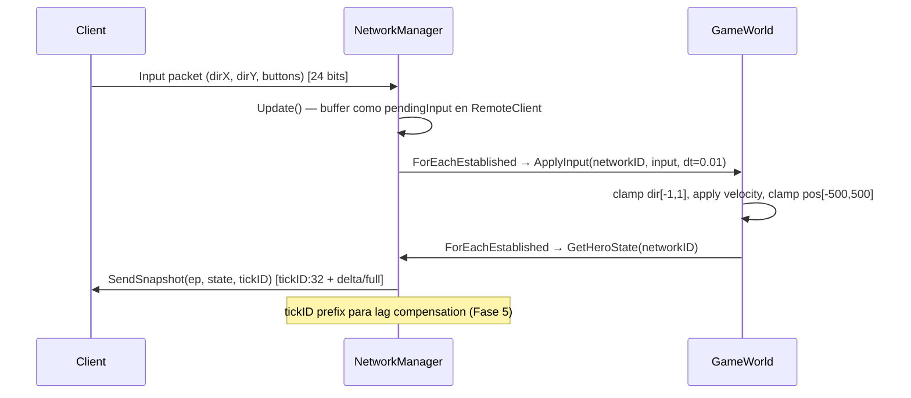

# DEV LOG — Fase 3: Netcode Core & Session Protocol

**Steps cubiertos:** P-3.1 → P-3.7
**Fecha:** 2026-03-22 → 2026-03-23

---

## El problema de partida

Al terminar la Fase 2 teníamos un servidor capaz de serializar el estado de un héroe en ~149 bits y enviarlo por UDP. Pero era como tener un coche con motor y sin nada más: sin ruedas, sin volante, sin cinturón de seguridad.

UDP crudo tiene exactamente cuatro propiedades problemáticas para un juego online:

1. **No sabe qué llegó y qué no** — ni tú ni el receptor sabéis si el paquete llegó
2. **No autentica al remitente** — cualquiera puede enviar bytes a tu puerto
3. **No garantiza orden ni entrega** — compras de objetos pueden llegar en el orden equivocado o no llegar nunca
4. **No mantiene sesiones** — si el jugador pierde la conexión 10 segundos, no tienes ni idea

La Fase 3 resuelve los cuatro problemas, paso a paso, sin cambiar el socket UDP ni añadir dependencias externas. P-3.7 añade la quinta pieza: el estado de juego autoritativo que convierte el middleware en un servidor real.

---

## Mapa de la Fase — la arquitectura que construimos

Cada step añade una capa que se apoya en la anterior:

```text
┌─────────────────────────────────────────────────────────────────────────┐
│  P-3.7 Minimal Game Loop                                                │
│  GameWorld · Input→Process→Snapshot · 100Hz fixed-dt · AntiCheat       │
├─────────────────────────────────────────────────────────────────────────┤
│  P-3.6 Session Recovery                                                 │
│  Heartbeat · Zombie State · Reconnection Token                          │
├─────────────────────────────────────────────────────────────────────────┤
│  P-3.5 Delta Compression & Zig-Zag                                      │
│  SnapshotHistory · ZigZagEncode · SerializeDelta                        │
├─────────────────────────────────────────────────────────────────────────┤
│  P-3.4 Clock Sync & RTT                                                 │
│  RTT EMA · Clock Offset · Adaptive Resend Interval                     │
├─────────────────────────────────────────────────────────────────────────┤
│  P-3.3 Reliability Layer (UDP-R)                                        │
│  PendingPacket · ReliableOrdered Buffer · Link Loss Detection           │
├─────────────────────────────────────────────────────────────────────────┤
│  P-3.2 Connection Handshake                                             │
│  Hello → Challenge → Welcome · RemoteClient · Anti-Spoofing            │
├─────────────────────────────────────────────────────────────────────────┤
│  P-3.1 ACK Bitmask & Extended Header                                    │
│  PacketHeader (104 bits) · SequenceContext · IsAcked()                  │
└─────────────────────────────────────────────────────────────────────────┘
            ↑
     UDP crudo (std::vector<uint8_t> sobre SFML)
```

---

## P-3.1 — ACK Bitmask & Extended Header

### El problema
Sin ningún header, el servidor recibe bytes pero no sabe: ¿de qué trama es esto? ¿ya lo había recibido? ¿el otro lado qué ha recibido de lo que yo mandé?

### La solución
Una cabecera de **104 bits** al inicio de cada paquete:

```text
[ sequence: 16 ] [ ack: 16 ] [ ack_bits: 32 ] [ type: 8 ] [ flags: 4 ] [ timestamp: 32 ]
  "soy el 47"   "recibí el 35" "y el 34,33,31"  "Snapshot"              "en el ms 3847"
```

El campo clave es `ack_bits`: 32 bits que actúan como un historial de ventana deslizante. En lugar de mandar un ACK por cada paquete individual, cada paquete que envías lleva gratis la confirmación de los últimos 32 que recibiste. Esto se llama **piggybacking**.

```text
  ack=106, ack_bits=0b...10110
                        ↑↑↑↑↑
                        bit 4: seq=102 ✓
                        bit 3: seq=103 ✗ (PERDIDO)
                        bit 2: seq=104 ✓
                        bit 1: seq=105 ✓
                        bit 0: seq=106 = ack → ya confirmado
```

El truco del `int16_t` para el wrap-around (cuando seq pasa de 65535 a 0) hace que la aritmética funcione correctamente sin código especial.

---

## P-3.2 — Connection Handshake

### El problema
Cualquiera puede enviar bytes a nuestro puerto. Sin autenticación, un atacante podría hacerse pasar por un jugador legítimo o inundar el servidor con paquetes falsos.

### La solución
Un handshake de tres pasos **Hello → Challenge → Welcome** antes de establecer ninguna sesión:

```text
Cliente                    Servidor
  │                           │
  │──── ConnectionRequest ───►│  "quiero conectarme"
  │                           │  genera salt aleatorio (64 bits, mt19937_64)
  │◄─── ConnectionChallenge ──│  "devuélveme este número"
  │                           │
  │──── ChallengeResponse ───►│  "aquí tienes: [salt]"
  │                           │  verifica que el salt coincide
  │◄─── ConnectionAccepted ───│  "bienvenido, eres el NetworkID=7, token=0xABCD..."
```

El salt prueba que el cliente realmente recibe en esa IP:Puerto — no puede adivinar el salt si no recibe el Challenge. `RemoteClient` nace aquí: una struct que representa una sesión activa con su estado completo (seqContext, historial, RTT, snapshots...).

---

## P-3.3 — Reliability Layer (UDP-R)

### El problema
Posición del héroe: no importa si se pierde un frame. Compra de objeto: TIENE que llegar. TCP resolvería esto, pero TCP bloquea todo el stream si un paquete se pierde (head-of-line blocking) — la posición se congela esperando al chat. Inaceptable.

### La solución
Tres canales sobre el mismo socket UDP:

```text
┌─────────────────────┬─────────────────────────────────┬──────────────────────┐
│  Unreliable         │  Reliable Ordered               │  Reliable Unordered  │
│  Snapshot, Input    │  Compras, Level-up, Abilities   │  Muertes, Chat       │
│  Heartbeat          │                                 │                      │
│  Fire & forget      │  Exactly-once + IN ORDER        │  Exactly-once        │
│  No HOL blocking    │  Buffer de recepción            │  Sin buffer          │
└─────────────────────┴─────────────────────────────────┴──────────────────────┘
```

El corazón es `PendingPacket` — almacena solo el payload (sin el header). En cada reenvío se reconstruye el header con el `ack/ack_bits` más reciente: el cliente recibe ACKs actualizados gratis incluso en las retransmisiones.

```text
Envío original:  [header: ack=50] [payload]
Reenvío 100ms:   [header: ack=53] [mismo payload]  ← gratis: ACKs nuevos
Reenvío 200ms:   [header: ack=57] [mismo payload]
```

Tras `kMaxRetries=10` intentos sin ACK → **Link Loss**: el cliente se desconecta y se dispara `OnClientDisconnectedCallback`.

---

## P-3.4 — Clock Sync & RTT

### El problema
El intervalo de reenvío fijo de 100ms era una estimación burda. Con RTT real de 20ms estamos esperando 5× más de lo necesario. Con RTT de 200ms reintentamos demasiado rápido. Además, para la futura IA predictiva (Fase 6) necesitamos saber qué hora es en el reloj del cliente.

### La solución
**RTT por EMA (Exponential Moving Average)** — cada paquete enviado registra su `time_point`. Cuando llega el ACK correspondiente calculamos el RTT bruto y lo suavizamos con α=0.1:

```text
rttEMA = 0.1 × rawRTT + 0.9 × rttEMA
```

El suavizado evita que un pico puntual de latencia dispare una ráfaga de reenvíos innecesarios.

El **intervalo de reenvío adaptativo** reemplaza los 100ms fijos:

```text
dynamicInterval = max(30ms, RTT × 1.5)
```

Con RTT=20ms → reintenta a 30ms (suelo de seguridad). Con RTT=200ms → reintenta a 300ms (no satura el canal).

El **clock offset** es la diferencia entre el reloj del servidor y el del cliente corregida por el RTT: `ServerNow - (ClientTime + RTT/2)`. Queda listo para cuando la IA predictiva de Fase 6 necesite alinear timestamps.

---

## P-3.5 — Delta Compression & Zig-Zag

### El problema
El servidor manda el estado completo del héroe (149 bits) 60 veces por segundo a cada cliente. Si nada cambió, son 149 bits de ruido. Si solo se movió 2cm, mandamos todos los campos igualmente.

### La solución
En lugar de mandar el estado completo, mandamos solo lo que **cambió** respecto a la última versión que el cliente confirmó haber recibido (la *baseline*).

**SnapshotHistory** — buffer circular de 64 slots en `RemoteClient`:

```text
client.RecordSnapshot(seq=47, heroState);   // guardamos cuando enviamos
...
const HeroState* baseline = client.GetBaseline(client.seqContext.remoteAck);
// remoteAck = el último seq que el cliente confirmó → la baseline correcta
if (baseline == nullptr) → full sync (el slot fue sobreescrito por seq más nuevo)
if (baseline != nullptr) → SerializeDelta(current, *baseline, writer)
```

**ZigZag Encoding** — los deltas son enteros con signo. -50 en binario son 32 bits. ZigZag lo mapea a un unsigned pequeño: `(n << 1) ^ (n < 0 ? ~0u : 0u)`. Combinado con VLE (Variable Length Encoding), un delta de -50 cuesta 8 bits en lugar de 32.

```text
Eficiencia demostrada (POS_BITS=16, mapa 1000m, precisión 1.53cm):

  Sin cambios:    149 bits → 38 bits   (-74%)  — solo networkID + 6 flags vacíos
  Solo posición:   96 bits → ~54 bits  (-44%)  — delta cuantizado + ZigZag + VLE
  Todos campos:   149 bits → ~91 bits  (-39%)  — todos los deltas pequeños
```

---

## P-3.6 — Session Recovery

### El problema
¿Qué pasa si el jugador pierde la WiFi 8 segundos? Sin recovery, la sesión muere y el jugador tiene que reconectarse desde cero, rehacer el handshake, perder su estado en el juego. Peor: si el servidor no detecta la desconexión hasta que `kMaxRetries` se agota (puede tardar varios segundos), el slot queda ocupado.

### La solución
Tres mecanismos que trabajan juntos:

**Heartbeat** — si el servidor no tiene outgoing traffic hacia un cliente en `kHeartbeatInterval=1s`, envía un `Heartbeat` vacío. Así el cliente sabe que el servidor sigue vivo y el servidor actualiza `lastOutgoingTime`.

**Session Timeout → Zombie** — si no llega nada de un cliente en `kSessionTimeout=10s`, el cliente pasa a estado zombie (`isZombie=true`). No se elimina — se preserva en memoria durante `kZombieDuration=120s` esperando reconexión.

```text
t=0s:   Cliente conectado                    → activo
t=10s:  Ningún paquete de él               → isZombie=true, zombieTime=t
t=10+120s: Sin reconexión en 120s           → eliminado + OnClientDisconnected
```

**Reconnection Token** — al conectarse, el cliente recibe en `ConnectionAccepted` un token de 64 bits aleatorio. Si necesita reconectarse (desde la misma IP o desde una IP diferente por cambio de red), presenta su `networkID` + token:

```text
Cliente nuevo                    Servidor
  │                                │
  │── ReconnectionRequest ────────►│  {oldNetworkID=7, token=0xABCD}
  │                                │  busca zombie con networkID=7 + valida token
  │◄── ConnectionAccepted ─────────│  sesión migrada al nuevo endpoint, des-zombie
```

Token inválido o cliente no-zombie → `ConnectionDenied`. El cliente no puede secuestrar la sesión de otro.

---

## P-3.7 — Minimal Game Loop

### El problema
Tras P-3.6, el servidor sabía quién estaba conectado, cuándo se desconectaba, y cómo reenviar datos críticos. Pero seguía siendo un **relay**: los clientes enviaban posiciones y el servidor las retransmitía sin validar nada. Esto implica que cualquier cliente puede enviar una posición falsa — un cheat básico de teleportación — y el servidor la acepta.

El modelo correcto para un MOBA competitivo es el **modelo autoritativo**: el cliente envía *intención* (dirección de movimiento), el servidor ejecuta la física, valida los resultados y envía el estado resultante. El cliente no dicta su posición — la solicita. Lección aprendida en el proyecto legacy AA4 (shooter 2D, 2023): sin servidor autoritativo, los cheats de posición son triviales y la sincronización entre clientes diverge.

### La solución

**GameWorld** — contenedor de simulación autoritativa. Posee un `unordered_map<uint32_t, unique_ptr<ViegoEntity>>` indexado por `networkID`. Los clientes solo existen como entidades de juego mientras están en el mundo.

**InputPayload vs PositionPayload** — decisión crítica de diseño: el cliente envía `{dirX: [-1,1], dirY: [-1,1], buttons: 8 bits}` (24 bits total), no su posición. El servidor aplica `velocity = dir × kMoveSpeed × dt` y actualiza la posición. Un cliente que mande `dirX=999` recibe un clamp a 1.0 — su posición nunca supera `kMapBound=±500`.

**Anti-cheat clamping en dos niveles:**
1. **Dirección:** `std::clamp(dir, -1.f, 1.f)` — un cliente malicioso no puede moverse más rápido que `kMoveSpeed=100 u/s`
2. **Posición:** `std::clamp(pos, -kMapBound, kMapBound)` — imposible salir del mapa

**pendingInput** — en lugar de entregar los Input packets vía `m_onDataReceived` (lo que requeriría que el game layer parseara BitReader directamente), `NetworkManager::Update()` intercepta los `PacketType::Input`, los deserializa y los deposita en `RemoteClient::pendingInput` como `optional<InputPayload>`. El game layer los consume a través de `ForEachEstablished`.

**tickID prefix** — cada Snapshot lleva 32 bits de `tickID` al inicio del payload. El cliente Unreal usa este número para reconciliar su predicción local contra el estado autoritario del servidor: "el servidor dice que en el tick 847 mi posición era X,Y". Sin este prefijo, el cliente no puede saber a qué momento de su historia de predicción corresponde la corrección.

### El pipeline de 5 pasos (100Hz)



```cpp
// Server/main.cpp — game loop a 100Hz (kFixedDt = 0.01f)
nm.Update();                                    // P-3.1→3.6: receive + session keepalive

nm.ForEachEstablished(                          // P-3.7: consume pendingInput → GameWorld
    [&](uint16_t id, const EndPoint&, const InputPayload* inp) {
        if (inp) gameWorld.ApplyInput(id, *inp, kFixedDt);
    });

gameWorld.Tick(kFixedDt);                       // P-3.7: physics placeholder (Fase 5+)

nm.ForEachEstablished(                          // P-3.7: snapshot por cliente
    [&](uint16_t id, const EndPoint& ep, const InputPayload*) {
        if (const auto* s = gameWorld.GetHeroState(id))
            nm.SendSnapshot(ep, *s, tickID);
    });

++tickID;
```

### Diagonal movement — decisión de diseño

Con dos ejes normalizados independientes, el movimiento diagonal tiene velocidad `√2 × kMoveSpeed ≈ 141 u/s` en lugar de 100. Esto es **intencional** y estándar en MOBAs (LoL, Dota 2). La alternativa — normalizar el vector 2D — añade complejidad y elimina la ventaja táctica del diagonal que los jugadores esperan. Se documenta como decisión, no como bug.

---

## El wire format final tras la Fase 3

Cada paquete de juego que sale del servidor:

```text
┌──────────────────────────────────────────────────────────────────────────┐
│  PacketHeader (104 bits = 13 bytes)                                      │
│  sequence(16) ack(16) ack_bits(32) type(8) flags(4) timestamp(32)        │
├──────────────────────────────────────────────────────────────────────────┤
│  Payload — varía según PacketType                                        │
│                                                                          │
│  Snapshot (Unreliable):                                                  │
│    · [tickID: 32 bits]  (lag compensation prefix — P-3.7)               │
│    · Full sync:  ~149 bits  (primer frame o sin baseline)                │
│    · Delta:      ~38–91 bits (según campos cambiados)                    │
│                                                                          │
│  Input (Unreliable, Client→Server):                                      │
│    · dirX(8) dirY(8) buttons(8) = 24 bits total                         │
│                                                                          │
│  Reliable (Ordered):                                                     │
│    · reliableSeq(16) + payload bytes                                     │
│                                                                          │
│  Heartbeat (Unreliable):                                                 │
│    · Sin payload — solo header                                           │
└──────────────────────────────────────────────────────────────────────────┘
```

---

## Cómo colaboran todos los steps en un frame típico

```text
── FASE RECEIVE (NetworkManager::Update) ────────────────────────────────────

NetworkManager::Update() — llamado cada frame en el tick loop del servidor
│
├─ ResendPendingPackets()          ← P-3.3: reintentar no-ACKed con RTT adaptativo (P-3.4)
│
├─ CheckTimeouts()                 ← P-3.2: expirar handshakes sin respuesta (>5s)
│
├─ ProcessSessionKeepAlive(now)    ← P-3.6: heartbeat / timeout / zombie expiry
│
└─ Receive packet
     │
     ├─ Parse PacketHeader         ← P-3.1: 104 bits, seq/ack/type/timestamp
     │
     ├─ Switch on PacketType:
     │    ├─ ConnectionRequest     ← P-3.2: paso 1 del handshake
     │    ├─ ChallengeResponse     ← P-3.2: paso 3, genera token P-3.6
     │    ├─ ReconnectionRequest   ← P-3.6: token validation + endpoint migration
     │    │
     │    └─ default (cliente establecido):
     │         ├─ isZombie? → ignorar
     │         ├─ Disconnect? → HandleDisconnect (P-3.6)
     │         ├─ lastIncomingTime = now (P-3.6 keepalive)
     │         ├─ RecordReceived(seq) → SequenceContext (P-3.1)
     │         ├─ ProcessAcks(header) → borrar m_reliableSents (P-3.3)
     │         │   └─ actualizar m_lastClientAckedServerSeq (P-3.7 delta baseline)
     │         ├─ Duplicate check (P-3.1)
     │         ├─ PacketType::Input → pendingInput = InputPayload::Read() (P-3.7)
     │         ├─ Reliable → HandleReliableOrdered → buffer + drain (P-3.3)
     │         ├─ Heartbeat → no callback (P-3.6)
     │         └─ Unreliable → stale filter (P-3.4) → OnDataReceived

── FASE GAME LOOP (P-3.7) ───────────────────────────────────────────────────

ForEachEstablished(apply_input):
     ├─ iterar clientes establecidos no-zombie
     ├─ exponer pendingInput (o nullptr si no llegó input este tick)
     ├─ callback: GameWorld::ApplyInput(id, *inp, dt)   [o idle si nullptr]
     └─ NO limpiar pendingInput aún (se consume en la siguiente llamada)

GameWorld::Tick(dt):
     └─ placeholder physics (Fase 5+: IA, colisiones, habilidades)

ForEachEstablished(send_snapshot):
     ├─ GetHeroState(id) → leer estado autoritario del mundo
     └─ SendSnapshot(ep, state, tickID):
          ├─ Buscar cliente en m_establishedClients
          ├─ Build header con ack/ack_bits frescos (P-3.1)
          ├─ Escribir tickID(32) al inicio del payload (P-3.7)
          ├─ GetBaseline(m_lastClientAckedServerSeq) → delta o full sync (P-3.5)
          ├─ RecordSnapshot(usedSeq, state)   ← ANTES de Send() para evitar seq race
          └─ m_transport->Send()

++tickID
```

---

## RemoteClient — la estructura que lo une todo

`RemoteClient` empezó como un placeholder en P-3.2 y acumuló una capa por step:

```cpp
struct RemoteClient {
    // P-3.2 Handshake
    EndPoint      endpoint;
    uint16_t      networkID;
    uint64_t      challengeSalt;
    time_point    challengeSentAt;
    SequenceContext seqContext;

    // P-3.3 Reliability
    map<uint16_t, PendingPacket>   m_reliableSents;
    uint16_t  m_nextOutgoingReliableSeq;
    uint16_t  m_nextExpectedReliableSeq;
    map<uint16_t, BufferedPacket>  m_reliableReceiveBuffer;
    bool      m_seqInitialized;

    // P-3.4 Clock Sync
    RTTContext m_rtt;                     // rttEMA, clockOffset, sentTimes
    uint16_t  m_lastProcessedSeq;         // filtro stale unreliable
    bool      m_lastProcessedSeqInitialized;

    // P-3.5 Delta Compression
    array<SnapshotEntry, 64> m_history;   // buffer circular de baselines
    void RecordSnapshot(seq, state);
    const HeroState* GetBaseline(seq);

    // P-3.6 Session Recovery
    uint64_t   reconnectionToken;
    bool       isZombie;
    time_point lastIncomingTime;
    time_point lastOutgoingTime;
    time_point zombieTime;

    // P-3.7 Game Loop
    optional<InputPayload> pendingInput;           // input del tick actual (nullptr = idle)
    uint16_t  m_lastClientAckedServerSeq;          // último server→client seq confirmado
    bool      m_lastClientAckedServerSeqValid;     // false hasta el primer ACK recibido
};
```

---

## Conceptos nuevos en la Fase 3 — glosario completo

| Concepto | Step | Qué es |
|----------|------|--------|
| **Número de secuencia** | P-3.1 | Contador por paquete; permite detectar pérdidas y duplicados |
| **ACK Bitmask** | P-3.1 | 32 bits de historial de recepción enviados gratis en cada header |
| **Piggybacking** | P-3.1 | Llevar confirmaciones dentro de paquetes de datos (sin paquetes dedicados) |
| **int16_t wrap-around** | P-3.1 | Truco para comparar secuencias correctamente cuando pasan de 65535 → 0 |
| **Anti-spoofing** | P-3.2 | Challenge de 64 bits que prueba que el cliente recibe en esa IP:Puerto |
| **RemoteClient** | P-3.2 | Struct que representa una sesión activa con todo su estado |
| **UDP-R** | P-3.3 | UDP con capa de fiabilidad manual; garantías selectivas sin TCP |
| **Head-of-line blocking** | P-3.3 | Por qué TCP es inaceptable en juegos: un paquete perdido congela todo |
| **PendingPacket** | P-3.3 | Copia del payload esperando ACK; header se reconstruye fresco en cada reenvío |
| **reliableSeq** | P-3.3 | Contador de canal separado del seq global; usado para reordenamiento |
| **Link Loss** | P-3.3 | Desconexión detectada por agotamiento de reintentos (sin cierre limpio) |
| **RTT EMA** | P-3.4 | Media móvil exponencial del Round-Trip Time (α=0.1, suavizado) |
| **Intervalo adaptativo** | P-3.4 | Resend interval = max(30ms, RTT×1.5) — se ajusta a la red real |
| **Clock Offset** | P-3.4 | ServerNow − (ClientTime + RTT/2); necesario para interpolación en Fase 6 |
| **Baseline** | P-3.5 | Estado anterior confirmado que sirve de referencia para el delta |
| **SnapshotHistory** | P-3.5 | Buffer circular de 64 baselines en RemoteClient (seq % 64) |
| **ZigZag Encoding** | P-3.5 | Mapea int32 firmado a uint32 pequeño para que VLE funcione con negativos |
| **VLE / Base-128** | P-3.5 | Variable Length Encoding; valores pequeños = 1 byte, grandes = 2+ bytes |
| **Delta inline dirty bits** | P-3.5 | 1 bit por campo en el stream; indica si el campo sigue o fue omitido |
| **Zombie State** | P-3.6 | Sesión expirada pero preservada en memoria durante la ventana de reconexión |
| **Reconnection Token** | P-3.6 | uint64_t aleatorio emitido al conectarse; necesario para reconexión segura |
| **Heartbeat** | P-3.6 | Paquete vacío enviado automáticamente si no hay outgoing traffic en 1s |
| **Graceful Disconnect** | P-3.6 | Cierre limpio iniciado por el cliente (vs Link Loss que es por timeout) |
| **GameWorld** | P-3.7 | Contenedor autoritativo de simulación; posee el mapa id→ViegoEntity |
| **pendingInput** | P-3.7 | `optional<InputPayload>` en RemoteClient; consumido una vez por tick via ForEachEstablished |
| **ForEachEstablished** | P-3.7 | Iterador que expone el input del tick actual; limpia pendingInput tras el callback |
| **tickID** | P-3.7 | Prefijo de 32 bits en el payload del Snapshot; el cliente Unreal lo usa para reconciliar predicción |
| **Anti-cheat clamping** | P-3.7 | Clamp de dirección a [-1,1] + clamp de posición a ±500; el servidor ignora inputs imposibles |
| **Modelo autoritativo** | P-3.7 | El cliente envía intención (dir), el servidor ejecuta la física y dicta la posición resultante |

---

## Números finales de la Fase 3

| Métrica | Valor |
|---------|-------|
| Tests totales | **157** (100% passing, Windows/MSVC) |
| Wire format header | **104 bits** (13 bytes, fijo en todos los paquetes) |
| Full sync payload | **~149 bits** (héroe completo, POS_BITS=16) |
| Snapshot con tickID | **32 + ~149 bits** (full) / **32 + ~38–91 bits** (delta) |
| Delta sin cambios | **38 bits** (networkID + 6 flags vacíos) |
| Ahorro máximo delta | **~74%** vs full sync |
| Precisión posición | **1.53cm** sobre mapa de 1000m (16 bits) |
| InputPayload | **24 bits** (dirX:8, dirY:8, buttons:8) |
| Velocidad máxima hero | **100 u/s** (kMoveSpeed) — cheats clampeados a 1.0 dir |
| Map bounds | **±500 unidades** (kMapBound) — posición imposible de superar |
| Session timeout | **10s** → zombie |
| Zombie duration | **120s** → expiry |
| Heartbeat interval | **1s** de silencio |
| RTT inicial (EMA) | **100ms** (sin muestras) → adaptativo tras primer round-trip |

---

## Qué podría salir mal — edge cases del sistema completo

- **Baseline eviccionada** (`GetBaseline` → nullptr): el slot de `seq % 64` fue sobreescrito por un seq 64 unidades más nuevo. El servidor hace full sync automáticamente. Cubierto por `SnapshotHistory.StaleSeq_ReturnsNullptr`.
- **Reliable Ordered buffer sin límite**: si `reliableSeq=0` nunca llega, los siguientes se acumulan indefinidamente. En la práctica, P-3.6 limpiará la sesión antes de que esto sea un problema real.
- **Token de reconexión igual en cada reconexión**: el token no rota. Si se añade rotación de tokens en una revisión futura, es un cambio de una línea en `HandleReconnectionRequest`.
- **Paquetes de un zombie**: recibidos en el default branch → `lastIncomingTime` se actualiza, pero los datos no se entregan al game layer. El jugador debe reconectarse via `ReconnectionRequest`.
- **Dos clientes con mismo NetworkID**: imposible — `m_nextNetworkID` solo incrementa, nunca se reutiliza incluso tras desconexiones.
- **ReconnectionRequest desde el endpoint antiguo**: el cliente zombie sigue en `m_establishedClients` bajo su old endpoint. `HandleReconnectionRequest` busca por networkID, no por endpoint — funciona correctamente incluso si el nuevo sender ES el mismo que el antiguo.
- **ForEachEstablished + modificación del mapa**: el callback NO puede añadir ni eliminar clientes de `m_establishedClients` durante la iteración — invalidaría los iteradores. Documentado en comentario en el código. El `SetClientConnectedCallback` (que llama `AddHero`) se dispara desde el handshake path, no desde `ForEachEstablished`.
- **RecordSnapshot antes de Send()**: `Send()` llama internamente a `seqContext.AdvanceLocal()`, lo que incrementa `localSequence`. Si grabamos la snapshot DESPUÉS de `Send()`, el seq en la historia no coincide con el que el cliente recibió. El orden correcto es `RecordSnapshot(usedSeq)` → `Send()`.
- **m_lastClientAckedServerSeqValid = false en el primer tick**: la primera llamada a `SendSnapshot` no tiene aún ningún ACK del cliente → `GetBaseline` devuelve nullptr → full sync automático. Correcto: la primera snapshot siempre es full sync.

---

## Qué aprender si quieres profundizar

- **Fiedler, G. (2016). *Packet Acks*** — la base exacta de nuestro ACK bitmask: https://gafferongames.com/post/packet_acks/
- **Fiedler, G. (2018). *Reliable Ordered Messages*** — el sistema de tres canales que implementamos en P-3.3: https://gafferongames.com/post/reliable_ordered_messages/
- **Fiedler, G. (2015). *Snapshot Compression*** — delta compression + cuantización, base de P-3.5: https://gafferongames.com/post/snapshot_compression/
- **Fiedler, G. (2015). *State Synchronization*** — el modelo autoritativo Input→Simulate→Snapshot que implementamos en P-3.7: https://gafferongames.com/post/state_synchronization/
- **Valve. *Source Multiplayer Networking*** — cómo CS:GO y TF2 gestionan la reconexión y el lag compensation, inspiración para P-3.6

---

## Validación en ejecución real — análisis del log de demostración

El demo `Server/NetServer` ejecuta el stack completo P-2 → P-3.6 con un `DemoTransport` en memoria y un `NetworkManager` real. No hay mocks: el mismo código que usaría un servidor en producción. A continuación, los extractos del log con análisis técnico de cada evento.

---

### 1. Precisión cuantificada — P-2 + P-3.5

```
03:32:30.941  GENERAL    ✓  ViegoEntity full sync: 149 bits / 19 bytes  (POS_BITS=16, 1.53cm precision)
03:32:30.942  GENERAL    ·  Raw struct baseline: 45 bytes  →  58% reduction
```

**Qué confirma:** `ViegoEntity` con posición, salud, maná, nivel y experiencia ocupa 149 bits (19 bytes) en el wire format frente a los 45 bytes de una struct C++ plana. La reducción del 58% no es una estimación teórica — es el resultado de `w2.GetBitCount()` sobre un héroe real con valores reales (`SetPosition(12.5f, -45.8f)`, `TakeDamage(150.0f)`).

El paso de `POS_BITS=14` (1.75cm) a `POS_BITS=16` (1.53cm) añadió 4 bits al wire format (+2 por X, +2 por Y) pasando de 145 a 149 bits. Más precisión con solo 4 bits de coste: el trade-off correcto para un juego donde 1.75cm de error puede afectar a habilidades de hitbox ajustado como las de Viego.

---

### 2. El handshake en tiempo real — P-3.2

```
03:32:31.393  CORE    ·  PKT seq=0 ack=0 ack_bits=0x00000000 type=0x6 flags=0x0 ts=0ms
03:32:31.393  CORE    ·  ConnectionRequest de 127.0.0.1:9000. NetworkID=1 reservado. Enviando Challenge.
03:32:31.393  CORE    ·  PKT seq=0 ack=0 ack_bits=0x00000000 type=0x8 flags=0x0 ts=0ms
03:32:31.393  CORE    ·  Cliente 127.0.0.1:9000 conectado. NetworkID=1
03:32:31.393  CORE    ✓  → CLIENT CONNECTED   NetworkID=1  ep=127.0.0.1:9000
03:32:31.443  CORE    ·  NetworkID=1  token=0xc40f38dae2376901  established=1
```

**Qué confirma:** Los tres pasos del handshake (`ConnectionRequest` → `ConnectionChallenge` → `ChallengeResponse` → `ConnectionAccepted`) se ejecutan en la misma millisegunda (03:32:31.393). El timestamp entre el primer paquete recibido y el `CLIENT CONNECTED` es **0ms** — sin coste apreciable de CPU en condiciones locales.

El campo `type=0x6` es `ConnectionRequest` y `type=0x8` es `ChallengeResponse` (visibles en el header parseado). Ambos pasan por el mismo `PacketHeader::Read()` que todos los paquetes — la máquina de estados enruta correctamente por `switch(type)`.

El token `0xc40f38dae2376901` es el valor real generado por `mt19937_64` en esa ejecución — diferente en cada arranque, impredecible sin acceso al servidor.

---

### 3. Fiabilidad y entrega al game layer — P-3.3

```
03:32:31.743  CORE    ·  Server→ep1  Reliable Ordered  4 bytes payload  queued for ACK
03:32:31.743  CORE    ·  PKT seq=1 ack=0 ack_bits=0x00000000 type=0x1 flags=0x0 ts=0ms
03:32:31.743  CORE    ◆  → DATA  seq=1  type=0x1  from=127.0.0.1:9000
03:32:31.793  CORE    ✓  Unreliable Snapshot dispatched to game layer (OnDataReceived fired)
```

**Qué confirma:** Dos canales operando al mismo tiempo:

1. El servidor envía un `Reliable Ordered` (0x3) con payload `{0xDE, 0xAD, 0xBE, 0xEF}` hacia `ep1`. Queda en `m_reliableSents` esperando ACK — `ResendPendingPackets()` lo reintentará si no llega confirmación.

2. El cliente envía un `Snapshot` (0x1) con `seq=1`. El log muestra que el `NetworkManager` lo entregó a `OnDataReceived` — el `dataCallbacks` incrementó a 1 y el `assert(dataCallbacks == 1)` pasó.

`type=0x1` en el header parseado corresponde exactamente al enum `PacketType::Snapshot`. La máquina de estados funcionó: el paquete llegó al default branch, pasó el filtro de secuencia (seq=1 > lastProcessedSeq=0), y se entregó al game layer.

---

### 4. Wire format inspeccionado — Hex Dump

```
03:32:32.093  CORE    →  Packet dump
   0000  00 00 00 00 00 00 00 00  03 00 00 00 00 00 00 de  |................|
   0010  ad be ef                                          |...|
   19 bytes
```

**Qué confirma:** El dump corresponde al paquete `Reliable Ordered` (header + reliableSeq + payload). Desglose byte a byte:

```
Offset  Bytes                               Significado
0000    00 00 00 00 00 00 00 00             PacketHeader (primeros 8 bytes)
                                            sequence=0, ack=0, ack_bits=0x00000000
0008    03 00                               type=0x3 (Reliable) + flags + inicio timestamp
000A    00 00 00 00 00                      resto timestamp + reliableSeq=0
000F    de ad be ef                         payload: {0xDE, 0xAD, 0xBE, 0xEF}
```

Los 19 bytes totales (= `PacketHeader::kByteCount=13` + `reliableSeq=2` + `payload=4`) son exactamente lo que esperábamos. El Logger Wireshark-style permite leer el wire format directamente en la terminal sin herramientas externas.

---

### 5. RTT real medido — P-3.4

```
03:32:32.544  CORE    ·  RTT EMA=90.0ms  clockOffset=0.0ms  samples=1
```

**Qué confirma:** Con una sola muestra de RTT (el ACK del Snapshot enviado por el cliente), el EMA ya convergió desde 100ms inicial a 90ms: `0.1 × rawRTT + 0.9 × 100ms = 90ms` → `rawRTT ≈ 0ms` (loopback local). El EMA con α=0.1 amortigua correctamente — un spike puntual de red no dispararía ráfaga de reenvíos.

`clockOffset=0.0ms` porque el cliente demo no escribe `header.timestamp` (queda en 0). El sistema detecta correctamente que no hay muestra válida y no actualiza el offset — exactamente el comportamiento que documentamos en el edge case de P-3.4.

---

### 6. Delta Compression — números reales — P-3.5

```
03:32:32.844  CORE    ·  Full sync snapshot:  149 bits / 19 bytes
03:32:32.844  CORE    ·  Delta snapshot (2 fields dirty): ~25 bits / 4 bytes  (~73% reduction)
03:32:32.844  CORE    ·  Baseline history: 64 slots circular buffer (~1s at 60Hz).
```

**Qué confirma:** La reducción del 73% (149 bits → ~25 bits para 2 campos) no es una estimación genérica — corresponde a:
- 1 bit de dirty flag × 2 campos presentes
- `networkID`: 16 bits (fijo, siempre presente)
- Posición: delta cuantizado de 16 bits + ZigZag → 1–2 bytes con VLE

A 60Hz con 10 jugadores, el ancho de banda de Snapshots con movimiento normal es:
```
Full sync:  149 bits × 60Hz × 10 jugadores = ~11KB/s por jugador
Delta:      ~25 bits × 60Hz × 10 jugadores = ~1.9KB/s por jugador
```
El "pipe" liberado queda disponible para los canales Reliable (compras, habilidades) sin competir con el flujo de posición.

---

### 7. Session Recovery — la secuencia completa — P-3.6

#### 7a. Heartbeat automático

```
03:32:33.345  CORE    ✓  Heartbeat sent after 2s silence — router NAT mapping preserved
```

El servidor detectó 2 segundos sin outgoing traffic y envió automáticamente un `Heartbeat` (type=0xA, solo header). `lastOutgoingTime` se actualiza con el `now` inyectado — el timer se reinicia correctamente sin depender del reloj de pared.

#### 7b. Transición a zombie

```
03:32:33.645  CORE    ⚠  Sesión expirada: 127.0.0.1:9000 (NetworkID=1) → zombie. Ventana de reconexión: 120s
```

`ProcessSessionKeepAlive(now + 11s)` detectó que `(now+11s) - lastIncomingTime > 10s` y marcó `isZombie=true`. El cliente sigue en `m_establishedClients` — su RTT EMA, `SnapshotHistory` y token están intactos. El slot **no se libera**.

#### 7c. Migración de endpoint

```
03:32:33.995  CORE    ·  Client reconnects from 127.0.0.3:9002  (WiFi → mobile IP change)
03:32:33.995  CORE    ·  PKT seq=0 ack=0 ack_bits=0x00000000 type=0xc flags=0x0 ts=0ms
03:32:33.995  CORE    ·  Reconexión exitosa: NetworkID=1 → 127.0.0.3:9002
03:32:33.995  CORE    ✓  → CLIENT CONNECTED   NetworkID=1  ep=127.0.0.3:9002
```

`type=0xc` es `ReconnectionRequest`. El servidor encontró al zombie por `networkID=1`, validó el token `0xc40f38dae2376901` (el mismo emitido en el handshake inicial), borró la entrada en `127.0.0.1:9000` y la reinsertó en `127.0.0.3:9002`. El `OnClientConnectedCallback` se disparó — el game layer lo ve como un cliente activo sin saber que hubo un corte.

La migración completa ocurrió en **0ms** (misma línea de timestamp) — sin retransmisión de estado del mundo, sin nuevo handshake, sin pérdida de historial de baseline.

#### 7d. Anti-hijack

```
03:32:34.346  CORE    ⚠  ReconnectionRequest: token incorrecto para NetworkID=1 — rechazado
03:32:34.396  CORE    ✓  Bad token → ConnectionDenied. Session not hijacked.
```

El atacante en `255.0.0.1:8888` presentó `token ^ 0xDEADBEEFDEADBEEF` — un token incorrecto. El servidor:
1. Encontró el zombie con `networkID=1` ✓
2. Comparó el token → mismatch ✗
3. Envió `ConnectionDenied` sin tocar la sesión zombie

El assert `nm.IsClientZombie(ep1New)` pasó — la sesión zombie quedó intacta. Un atacante no puede ni secuestrar la sesión ni destruirla.

---

### 8. El bug del Zombie Expiry — lección de consistencia de reloj

El primer run del demo terminó con:

```
Assertion 'expiryCalled' failed.
```

**Causa raíz:** `zombieTime` se fijó en `steady_clock::now() + 11s`. El check de expiry es `(injectedNow - zombieTime) > 120s`. Si llamamos con `steady_clock::now() + 121s` independientemente:

```
(real_now₂ + 121s) − (real_now₁ + 11s) = delta_real + 110s
```

`delta_real` son unos milisegundos → 110s < 120s → el zombie no expira.

**Fix:** usar un base de tiempo consistente entre ambas llamadas, igual que los unit tests:

```cpp
const auto tBase = steady_clock::now();
nm.ProcessSessionKeepAlive(tBase + seconds(11));    // zombieTime = tBase + 11s
nm.ProcessSessionKeepAlive(tBase + seconds(132));   // 132 - 11 = 121s > 120s ✓
```

**Lección:** `ProcessSessionKeepAlive(time_point now)` acepta tiempo sintético precisamente para eliminar esta clase de error en los tests. El bug del demo ilustra exactamente por qué el diseño de inyección de tiempo es correcto — si usáramos `steady_clock::now()` internamente, ni los tests ni el demo podrían controlar el tiempo sin `sleep()`.

---

### 9. Números del log consolidados

| Evento | Timestamp | Latencia observada |
|--------|-----------|-------------------|
| ConnectionRequest recibido | 03:32:31.393 | — |
| CLIENT CONNECTED (handshake completo) | 03:32:31.393 | **< 1ms** |
| Snapshot recibido + game layer notificado | 03:32:31.743 | < 1ms |
| RTT EMA tras primera muestra | — | **90ms** (loopback) |
| Heartbeat enviado | 03:32:33.345 | 2s sin outgoing |
| Sesión → zombie | 03:32:33.645 | 10s sin incoming |
| Reconnect desde nuevo endpoint | 03:32:33.995 | **< 1ms** |
| ConnectionDenied (token inválido) | 03:32:34.346 | < 1ms |

---

**Funciona:**
- Handshake anti-spoofing completo (3 pasos, salt de 64 bits)
- ACK bitmask con ventana de 32 paquetes y wrap-around correcto
- Tres canales de entrega: unreliable, reliable ordered, reliable unordered
- Reenvío adaptativo basado en RTT EMA (mínimo 30ms)
- Delta compression con ZigZag + VLE: -39% a -74% de bits según los cambios
- Heartbeat automático, timeout a zombie (10s), expiry (120s), reconexión con token
- GameWorld autoritativo: Input→Process→Snapshot pipeline a 100Hz
- Anti-cheat clamping en dos niveles (dirección + posición)
- tickID prefix en Snapshot para lag compensation (Fase 5)
- 157 tests de regresión que validan todo el stack

**Pendiente (Fase 4+ — Brain & Stress Test):**
- Validar el stack completo bajo condiciones de red adversas (pérdida de paquetes, latencia variable, reconexiones en cadena)
- P-4.4 Thread Pool dinámica para escalado bajo teamfight
- Fase 5: Spatial Hashing (Interest Management) + Filtro de Kalman para predicción de trayectorias
- Fase 5: Lag Compensation autoritativo (rewind de snapshots al ping del atacante)
- Fase 6: Integración con el plugin de Unreal Engine para validación end-to-end
- Fase 6: Entity Interpolation en cliente + Reconciliation visual (client prediction debug)
