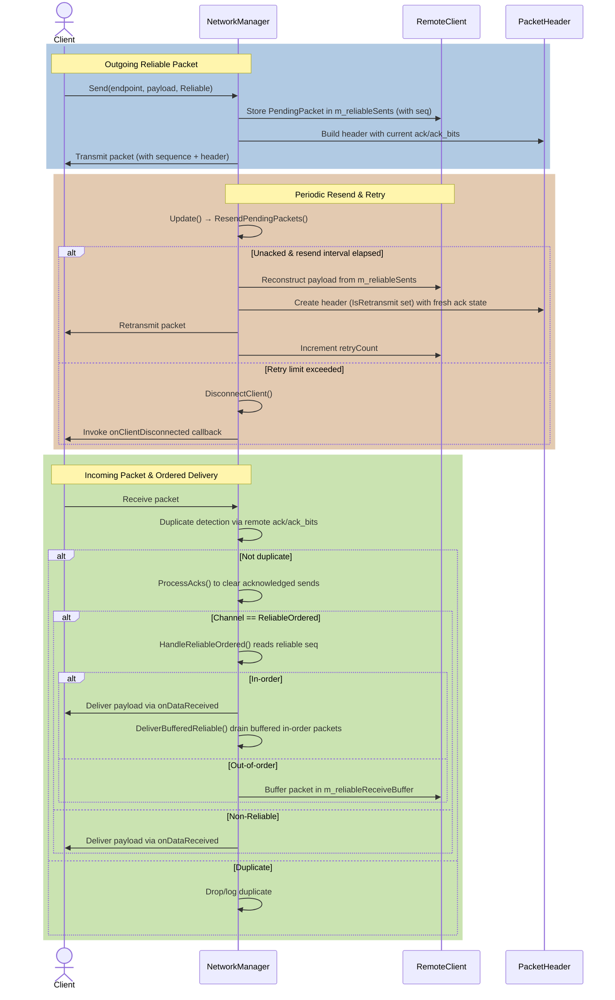

# DEV LOG — P-3.3 Reliability Layer (UDP-R)

**Propuesta:** P-3.3 Reliability Layer
**Fecha:** 2026-03-21

---

## ¿Qué problema resolvíamos?

UDP no garantiza nada. Si envías un paquete, puede llegar, puede no llegar, puede llegar dos veces, puede llegar antes que uno que enviaste antes. Para juegos esto está bien para la posición (un frame de retraso no importa), pero NO para:

- **Compras de objetos**: si el servidor no recibe que compraste el hacha, nunca te la da
- **Level-up**: el servidor necesita saber exactamente cuándo subiste de nivel
- **Muertes**: el contador de bajas del scoreboard no puede desincronizarse
- **Habilidades lanzadas**: el damage tiene que aplicarse exactamente una vez

La solución estándar en netcode de juegos es **UDP-R**: UDP con una capa de fiabilidad encima, implementada a mano. No usamos TCP porque TCP tiene head-of-line blocking — si un paquete se pierde, TCP para todo hasta recibirlo. En juegos esto es fatal: no quieres que la posición de tu héroe se congele porque se perdió un chat.

---

## ¿Qué hemos construido?

Un sistema de **tres canales** sobre el mismo socket UDP:

| Canal | PacketType | Garantía | Uso |
|-------|-----------|----------|-----|
| **Unreliable** | Snapshot (0x1), Input (0x2) | Ninguna — llega o no | Posición, movimiento |
| **Reliable Ordered** | Reliable (0x3) | Llega exactamente una vez, en orden | Compras, abilities, level-up |
| **Reliable Unordered** | ReliableUnordered (0x4) | Llega exactamente una vez, cualquier orden | Muertes, chat |

---

## Cómo funciona — el flujo completo

### La base: el ACK bitmask de P-3.1

Antes de hablar de reenvíos, recordemos que ya tenemos en el header:

```
[sequence: 16 bits] — número de secuencia DE ESTE paquete
[ack:      16 bits] — último seq que yo he recibido de ti
[ack_bits: 32 bits] — ¿recibí los 32 paquetes anteriores a `ack`?
```

El `ack` + `ack_bits` juntos me dicen qué paquetes ha recibido el otro lado. Esto es piggybacking: no necesito mandar paquetes dedicados de confirmación, cada paquete de datos lleva los ACKs gratis en el header.

### IsAcked() — la pregunta fundamental

```cpp
bool IsAcked(uint16_t seq) const {
    const int16_t diff = static_cast<int16_t>(ack - seq);
    if (diff == 0) return true;                          // ¿es exactamente el `ack`?
    if (diff > 0 && diff <= 32)
        return (ack_bits >> (diff - 1)) & 1u;            // ¿está en la ventana de 32?
    return false;
}
```

"¿El header que acabo de recibir confirma que el destinatario recibió el paquete con número de secuencia `seq`?"

El `int16_t` cast es el truco clave para manejar el wrap-around: cuando la secuencia llega a 65535 y vuelve a 0, la resta modular sigue funcionando. Es el mismo patrón que ya teníamos en `SequenceContext::RecordReceived`.

Ejemplo:
- Envié seq=100, seq=101, seq=102
- Recibo un paquete con ack=102, ack_bits=0b11 (bits 0 y 1 activos)
- IsAcked(102): diff=0 → **true** (ACK directo)
- IsAcked(101): diff=1, bit 0 de ack_bits=1 → **true**
- IsAcked(100): diff=2, bit 1 de ack_bits=1 → **true**
- IsAcked(99): diff=3, bit 2 de ack_bits=0 → **false** (perdido)

### PendingPacket — la cola de reenvío

```cpp
struct PendingPacket {
    std::vector<uint8_t>                   payload;      // Solo los bytes DESPUÉS del header
    uint16_t                               sequence;     // El número de secuencia global
    std::chrono::steady_clock::time_point  lastSentTime; // ¿Cuándo lo mandamos por última vez?
    uint8_t                                retryCount  = 0;
    uint8_t                                channelType;  // Reliable o ReliableUnordered
};
```

El punto clave: **guardamos solo el payload (bytes post-header), no el header completo**.

¿Por qué? Porque en cada reenvío queremos reconstruir el header con el `ack`/`ack_bits` **más reciente** del cliente. Así cada retransmisión lleva implícitamente las confirmaciones acumuladas mientras esperábamos — más información gratis sin coste extra de ancho de banda.

```
Envío original:  [header: ack=50, bits=...] [payload]
Reenvío 100ms:   [header: ack=53, bits=...] [mismo payload]  ← ack actualizado
Reenvío 200ms:   [header: ack=57, bits=...] [mismo payload]  ← sigue actualizando
```

### Send() — enviar un paquete fiable

```
1. Buscar al cliente en m_establishedClients
2. Construir PacketHeader con el estado ACK actual del cliente (piggybacking)
3. Si es Reliable: escribir los 16 bits del reliableSeq antes del payload
4. Escribir el payload byte a byte
5. Si Reliable o ReliableUnordered: guardar PendingPacket (solo bytes post-header)
6. AdvanceLocal() — incrementar el número de secuencia global
7. Si Reliable: incrementar m_nextOutgoingReliableSeq
8. Enviar por m_transport
```

El `reliableSeq` es diferente al `sequence` del header. El `sequence` del header es el número global de todos los paquetes (sirve para el ACK bitmask). El `reliableSeq` es un contador propio del canal Reliable Ordered, que empieza en 0 y sube solo para los paquetes Reliable. Es el que usamos para el reordenamiento en recepción.

```
Paquete 1: header.sequence=5, reliableSeq=0 (primera compra)
Paquete 2: header.sequence=6 (snapshot, sin reliableSeq)
Paquete 3: header.sequence=7, reliableSeq=1 (segunda compra)
```

### ResendPendingPackets() — el motor de reenvío

Se llama al inicio de cada `Update()`, antes de procesar nuevos paquetes.

```
Para cada cliente establecido:
  Para cada PendingPacket en m_reliableSents:
    ¿Han pasado 100ms desde el último envío?
      SÍ y retryCount >= 10 → marcar para desconexión
      SÍ y retryCount < 10  → reconstruir header + append payload → enviar → ++retryCount
    NO → skip
Desconectar clientes marcados (después del bucle, nunca durante)
```

El "después del bucle" es importante: si llamas a `DisconnectClient()` mientras iteras `m_establishedClients`, invalidas el iterador y el programa se cae (undefined behavior). Guardar los endpoints para desconectar en un vector separado y procesar después es el patrón seguro.

### ProcessAcks() — confirmar entregas

```cpp
void NetworkManager::ProcessAcks(RemoteClient& client, const Shared::PacketHeader& header) {
    std::erase_if(client.m_reliableSents, [&header](const auto& entry) {
        return header.IsAcked(entry.first);
    });
}
```

Cada vez que llega un paquete de un cliente establecido, miramos su header y eliminamos de `m_reliableSents` todos los paquetes que ya confirma haber recibido. Si estábamos esperando ACK del seq=100 y el cliente nos manda un paquete con ack=100 → lo borramos, ya no hace falta reenviarlo.

### DisconnectClient() — Link Loss

Si un PendingPacket alcanza 10 reintentos sin ACK, se considera que el cliente está caído (Link Loss). No es un desconexión limpia — simplemente dejó de responder.

```
Log: "Link Loss: cliente IP:Puerto (NetworkID=X) desconectado tras 10 reintentos"
Disparar m_onClientDisconnected → notificar al game layer
Borrar de m_establishedClients
```

El game layer puede usar este callback para eliminar al héroe del mapa, liberar su slot, etc.

### Reliable Ordered — recepción y buffer

Los paquetes Reliable Ordered llevan un `reliableSeq` de 16 bits justo después del header:

```
[header: 100 bits = 13 bytes]
[reliableSeq: 16 bits]
[payload: N bytes]
```

Al recibirlo en `HandleReliableOrdered`:

```
1. Leer los 16 bits de reliableSeq
2. Extraer el payload: (totalBits - 116) / 8 bytes
                         ↑100 header + 16 reliableSeq
3. ¿Es el que esperamos (m_nextExpectedReliableSeq)?
   SÍ  → entregar al game layer → incrementar expected → drenar buffer
   NO y es mayor → guardar en m_reliableReceiveBuffer[reliableSeq]
   NO y es menor → duplicado, ignorar
```

El "drenar buffer" (`DeliverBufferedReliable`) es el bucle que sigue entregando paquetes del buffer mientras el siguiente esperado esté disponible:

```
Esperamos reliableSeq=3
Buffer: {3: data_A, 5: data_B}
→ Entregar data_A, expected=4
→ No hay 4 en buffer, parar

Luego llega reliableSeq=4:
→ Entregar directamente, expected=5
→ Verificar buffer: hay 5 → entregar data_B, expected=6
→ No hay 6, parar
```

### Sin head-of-line blocking para canales Unreliable

Los paquetes Snapshot, Input, Heartbeat y ReliableUnordered **no pasan por el buffer Ordered**. Llegan → se entregan inmediatamente al game layer. Si falta el Reliable Ordered 3, la posición del héroe sigue actualizándose sin problemas.

---

## Diagrama de secuencia — visión global del sistema

Generado por CodeRabbit tras la revisión de la PR de P-3.3.



---

## Diagramas visuales

### Los tres canales — garantías de entrega

```
  ┌─────────────────────┬──────────────────┬──────────────────────────────┬──────────────────────────────┐
  │  Canal              │  PacketType      │  Garantía                    │  Uso en MOBA                 │
  ├─────────────────────┼──────────────────┼──────────────────────────────┼──────────────────────────────┤
  │  Unreliable         │  Snapshot  0x1   │  Fire & forget               │  Posición héroe (60Hz)       │
  │                     │  Input     0x2   │  Perdido = skip              │  Input del jugador           │
  │                     │  Heartbeat 0x5   │  No head-of-line blocking    │  Keepalive                   │
  ├─────────────────────┼──────────────────┼──────────────────────────────┼──────────────────────────────┤
  │  Reliable Ordered   │  Reliable  0x3   │  Exactly-once + IN ORDER     │  Compra de objeto            │
  │                     │                  │  Buffer de recepción         │  Level-up, ability cast      │
  ├─────────────────────┼──────────────────┼──────────────────────────────┼──────────────────────────────┤
  │  Reliable Unordered │  ReliableU 0x4   │  Exactly-once, any order     │  Notificación de muerte      │
  │                     │                  │  Sin buffer necesario        │  Chat                        │
  └─────────────────────┴──────────────────┴──────────────────────────────┴──────────────────────────────┘

  KEY INSIGHT: Unreliable y ReliableUnordered nunca bloquean la entrega de posición/input.
               Si se pierde un Reliable seq=3, los Snapshots siguen llegando sin pausa.
               TCP haría exactamente lo contrario (head-of-line blocking).
```

### PendingPacket lifecycle — de Send() a ACK o Link Loss

```
  Send(ep, payload, Reliable)
         │
         ▼
  Build PacketHeader          ┌─────────────────────────────────────────┐
  seq=N, ack, ack_bits  ────► │  m_reliableSents[N] = PendingPacket{   │
  timestamp = now             │    payload  (bytes POST-header only),   │
         │                    │    sequence = N,                        │
         │                    │    lastSentTime = now,                  │
         ▼                    │    retryCount = 0,                      │
  Transmit via UDP            │    channelType = Reliable               │
                              │  }                                      │
                              └────────────┬────────────────────────────┘
                                           │
                    ┌──────────────────────┘
                    │  Every Update() → ResendPendingPackets()
                    ▼
         elapsed > dynamicInterval? (RTT×1.5, min 30ms)
                    │
            NO ─────┘  (skip)
                    │
            YES
                    │
         retryCount >= kMaxRetries(10)?
                    │
            YES ────►  DisconnectClient()
                        → OnClientDisconnected
                        → erase from m_establishedClients
                    │
            NO
                    │
                    ▼
         Rebuild header (fresh ack/ack_bits + IsRetransmit flag)
         Append stored payload bytes
         Retransmit via UDP
         ++retryCount, lastSentTime = now
                    │
                    │  Meanwhile, on every incoming packet:
                    │  ProcessAcks(header) → IsAcked(N) == true?
                    │
                    └──YES──► erase_if m_reliableSents[N]  ✓  DELIVERED
```

### Reliable Ordered — buffer de recepción y drain

```
  Expected: m_nextExpectedReliableSeq = 3
  Packets arrive out of order: 5 → 4 → 6 → 3

  ┌──────────┬──────────────────────────────────────────────────┬──────────────────┐
  │  Recv    │  Decision                                        │  State after     │
  ├──────────┼──────────────────────────────────────────────────┼──────────────────┤
  │  seq=5   │  5 > 3 expected → buffer[5]                     │  exp=3 buf={5}   │
  │  seq=4   │  4 > 3 expected → buffer[4]                     │  exp=3 buf={4,5} │
  │  seq=6   │  6 > 3 expected → buffer[6]                     │  exp=3 buf={4,5,6}│
  │  seq=3   │  3 == 3 expected → DELIVER(3) → drain starts    │                  │
  │          │    drain: buf has 4 → DELIVER(4) → exp=5        │                  │
  │          │    drain: buf has 5 → DELIVER(5) → exp=6        │                  │
  │          │    drain: buf has 6 → DELIVER(6) → exp=7        │  exp=7 buf={}    │
  │          │    drain: buf empty → stop                       │                  │
  └──────────┴──────────────────────────────────────────────────┴──────────────────┘

  seq < expected → duplicate → silently ignored
  seq > expected → buffer (wait for the gap to fill)
  seq == expected → deliver immediately + drain
```

## El código clave — flujo de Update()

```cpp
void NetworkManager::Update() {
    ResendPendingPackets();   // ← NUEVO: intentar reenvíos antes de procesar
    CheckTimeouts();           // handshakes expirados
    // ... receive packet ...
    // ... parse header ...

    switch (type) {
        case ConnectionRequest:  ...
        case ChallengeResponse:  ...
        default:
            if (auto it = m_establishedClients.find(sender); ...) {
                client.seqContext.RecordReceived(header.sequence);
                ProcessAcks(client, header);          // ← NUEVO: borrar los confirmados

                if (type == Reliable)
                    HandleReliableOrdered(reader, client, sender, buffer->size() * 8);
                else if (m_onDataReceived)
                    m_onDataReceived(header, reader, sender);  // unreliable: entrega directa
            }
    }
}
```

---

## Nuevos campos en RemoteClient

```cpp
// Cola de envío fiable: keyed por número de secuencia global
std::map<uint16_t, PendingPacket>         m_reliableSents;

// Secuencia de canal Reliable Ordered — ENVÍO
uint16_t                                  m_nextOutgoingReliableSeq = 0;

// Secuencia de canal Reliable Ordered — RECEPCIÓN
uint16_t                                  m_nextExpectedReliableSeq = 0;
std::map<uint16_t, std::vector<uint8_t>>  m_reliableReceiveBuffer;
```

Cuatro campos, dos por dirección: uno para envío (`m_reliableSents` + `m_nextOutgoingReliableSeq`) y dos para recepción (`m_nextExpectedReliableSeq` + `m_reliableReceiveBuffer`).

---

## Conceptos nuevos en esta propuesta

| Concepto | Qué es | Por qué importa |
|----------|--------|-----------------|
| **UDP-R** | UDP + capa de fiabilidad manual | TCP tiene head-of-line blocking; UDP-R da garantías selectivas |
| **Head-of-line blocking** | Un paquete perdido bloquea todo lo demás | TCP hace esto; en juegos es mortal para datos de tiempo real |
| **Piggybacking** | Llevar ACKs gratis en headers de datos | No necesitas paquetes dedicados de confirmación |
| **PendingPacket** | Copia del payload esperando ACK | Solo el payload — el header se reconstruye fresco en cada reenvío |
| **reliableSeq** | Contador de canal separado del seq global | El seq global es para el ACK bitmask; el reliableSeq es para ordering |
| **Link Loss** | Timeout de reenvíos — cliente caído sin desconexión limpia | Diferente de la desconexión voluntaria (Fase 3.6) |
| **std::erase_if** | C++20: borrar de un contenedor con predicado | Patrón limpio para confirmar ACKs en masa |

---

## Qué podría salir mal (edge cases)

- **Misma secuencia reenviada después de ACK:** `ProcessAcks` ya borró la entrada; `ResendPendingPackets` no la encuentra → correcto.
- **Cliente desconectado mientras itera m_reliableSents:** Los endpoints se acumulan en `toDisconnect` y se procesan después del bucle → sin UB.
- **reliableSeq wrap-around (65535 → 0):** `static_cast<int16_t>(a - b) > 0` maneja el wrap correctamente con aritmética modular.
- **Buffer de recepción crece sin límite:** Si el emisor manda 100 Reliable Ordered y el seq=0 nunca llega, todos se acumulan. No hay límite implementado — en Fase 3.6 se limpiará con el timeout de sesión.
- **ReliableUnordered duplicado:** Si el original y un reenvío llegan ambos, el callback se llama dos veces. El game layer debe manejar idempotencia (aceptable para esta fase).

---

## Qué aprender si quieres profundizar

- Fiedler, G. (2018). *Reliable Ordered Messages* — explica exactamente este patrón con ejemplos de código C: https://gafferongames.com/post/reliable_ordered_messages/
- Fiedler, G. (2016). *Sending Large Blocks of Data* — fragmentación que vendrá en P-3.3+

---

## Estado del sistema tras esta implementación

**Funciona:**
- El game layer puede llamar `Send(to, payload, PacketType::Reliable)` para entregas garantizadas y ordenadas
- Los paquetes fiables se reenvían cada 100ms hasta confirmación o 10 intentos
- Los ACKs del bitmask de P-3.1 se usan para eliminar entradas confirmadas de la cola
- El game layer recibe `OnClientDisconnectedCallback` si un cliente deja de responder
- Unreliable y ReliableUnordered no bloquean la entrega de datos de posición/input

**Pendiente (próxima propuesta):**
- P-3.4 Clock Sync: RTT real → `kResendInterval` dinámico (RTT × 1.2) en lugar de 100ms fijo
- P-3.5 Delta Compression: baselines + zig-zag encoding para reducir payload de Snapshots
- P-3.6 Session Recovery: reconexión, tokens, heartbeats formales
