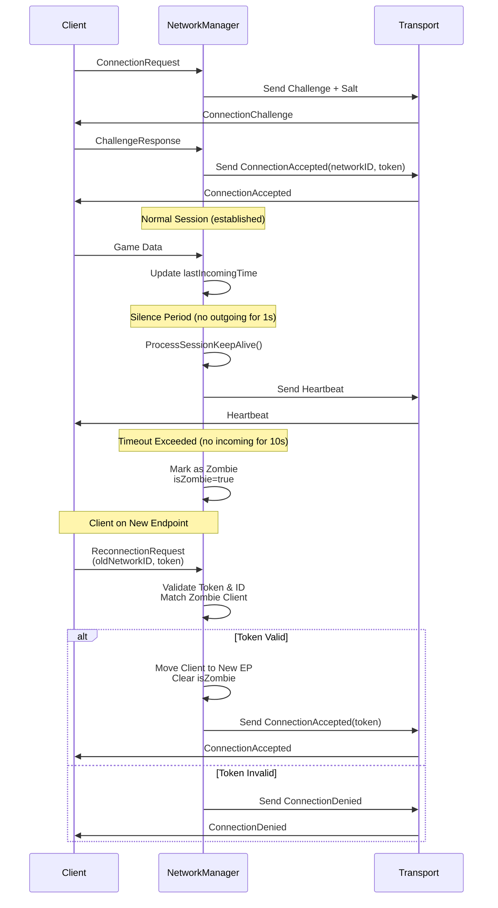

# DEV LOG — P-3.6 Session Recovery (Heartbeats & Timeouts)

**Propuesta:** P-3.6 Session Recovery
**Fecha:** 2026-03-22

---

## ¿Qué problema resolvíamos?

Tras P-3.3 sabemos detectar **Link Loss** — si un cliente deja de responder a paquetes fiables, lo desconectamos tras `kMaxRetries` intentos. Pero eso solo cubre el caso extremo: "el cliente está completamente muerto."

¿Qué pasa con los casos intermedios?

- El jugador pierde la WiFi **10 segundos** y la recupera — no queremos que pierda su partida
- El cliente se reconecta desde **otra IP/puerto** (cambio de red, CGNAT)
- El cliente cierra el juego **limpiamente** sin esperar a que el servidor detecte Link Loss
- El servidor lleva **3 segundos sin enviar nada** y el router NAT del jugador cierra el mapeo de puerto

Todos estos casos quedan sin respuesta si no existe una capa de recovery de sesión. P-3.6 la construye.

---

## ¿Qué hemos construido?

Cuatro mecanismos que trabajan juntos sobre el `NetworkManager`:

| Mecanismo | Trigger | Resultado |
|-----------|---------|-----------|
| **Heartbeat** | 1s sin outgoing traffic | Servidor envía paquete vacío para mantener el NAT y confirmar vida |
| **Session Timeout** | 10s sin incoming | Cliente marcado como zombie (`isZombie=true`) |
| **Zombie Expiry** | 120s sin reconexión | Cliente eliminado + `OnClientDisconnectedCallback` |
| **Reconnection Token** | `ReconnectionRequest` válido | Sesión migrada al nuevo endpoint, zombie limpiado |

---

## Cómo funciona — el flujo completo

### Diagrama de secuencia



---

### ProcessSessionKeepAlive — el motor de la recovery

Se llama al inicio de cada `Update()` con el tiempo actual. Recorre todos los clientes establecidos:

```text
Para cada cliente en m_establishedClients:
  │
  ├─ isZombie?
  │    └─ (now - zombieTime) > 120s → toExpire.push_back(endpoint)
  │
  ├─ (now - lastIncomingTime) > 10s → isZombie=true, zombieTime=now
  │
  └─ (now - lastOutgoingTime) > 1s  → Send(endpoint, {}, Heartbeat)

Después del bucle:
  Para cada endpoint en toExpire:
    → OnClientDisconnected callback
    → erase from m_establishedClients
```

El bucle de expiry se ejecuta **después** de iterar, nunca durante. Borrar del mapa mientras iteras sobre él invalida los iteradores → UB. Acumular en `toExpire` y procesar al final es el patrón seguro (igual que en `ResendPendingPackets`).

### Heartbeat — keepalive de NAT

El heartbeat resuelve un problema silencioso: los routers NAT cierran el mapeo de puerto tras ~30s de silencio. Si el servidor no manda nada durante 30s, el siguiente paquete del servidor **nunca llega** al cliente aunque el cliente esté perfectamente conectado.

Con `kHeartbeatInterval=1s`, el servidor manda un paquete mínimo si lleva 1s sin enviar nada. El heartbeat lleva el header completo (con `ack/ack_bits` frescos) así que también sirve de piggybacking gratuito.

Los heartbeats recibidos del cliente actualizan `lastIncomingTime` pero **no** disparan `OnDataReceived` — son infraestructura, no datos de juego.

### ReconnectionRequest — migración de endpoint

Cuando el cliente vuelve (posiblemente desde otra IP), presenta su `networkID` y el `reconnectionToken` que recibió al conectarse:

```text
1. Buscar en m_establishedClients un zombie con networkID == req.oldNetworkID
2. ¿El nuevo endpoint ya está ocupado por otro cliente activo?
   → SÍ: ConnectionDenied (sin tocar el zombie — no hay data loss)
3. ¿Token incorrecto?
   → ConnectionDenied
4. ✓ Valid: move(client), erase old entry, emplace at new endpoint
5. client.isZombie = false, lastIncomingTime = now, lastOutgoingTime = now
6. SendConnectionAccepted(newEp, networkID, token)
7. OnClientConnected callback
```

El punto 2 es crítico: la comprobación de endpoint ocupado ocurre **antes** de borrar la entrada zombie. Si lo hiciéramos al revés, borraríamos al zombie y luego `emplace` fallaría silenciosamente (los maps de C++ no reemplazan una clave existente) — perderíamos la sesión del zombie sin que nadie la recuperara.

### Reconnection Token — seguridad básica anti-hijack

El token es un `uint64_t` generado por `mt19937_64` al completar el handshake. Solo el cliente legítimo lo conoce porque lo recibió en `ConnectionAccepted`. Sin el token, un atacante no puede:
- Secuestrar la sesión de un cliente zombie
- Forzar al servidor a migrar el endpoint de una sesión activa

El token no rota en esta implementación — el mismo token sirve para reconectar indefinidamente durante la ventana de 120s. Si se quisiera añadir rotación, es un cambio de una línea en `HandleReconnectionRequest`.

---

## Diagramas visuales

### Ciclo de vida de una sesión — estados completos

```text
                        ConnectionRequest recibido
                                 │
                                 ▼
                    ┌─────────────────────────┐
                    │      m_pendingClients    │
                    │  (esperando ChallengeRsp)│
                    └────────────┬────────────┘
                                 │ ChallengeResponse correcto
                                 ▼
                    ┌─────────────────────────┐
                    │   m_establishedClients   │
                    │     isZombie = false     │◄─────────────────────────┐
                    └────────────┬────────────┘                          │
                                 │                                       │
              ┌──────────────────┼──────────────────┐                   │
              │                  │                   │                   │
              ▼                  ▼                   ▼                   │
     Disconnect PKT      Link Loss             10s sin incoming           │
     (graceful)          (kMaxRetries)         (no incoming)              │
              │                  │                   │                   │
              ▼                  ▼                   ▼                   │
     OnClientDisconnected  OnClientDisconnected  ┌──────────────────────┐│
     erase from map        erase from map        │  isZombie = true     ││
                                                 │  zombieTime = now    ││
                                                 └──────────┬───────────┘│
                                                            │            │
                                          ┌─────────────────┤            │
                                          │                 │            │
                                          ▼                 ▼            │
                                  120s sin reconexión   ReconnectionRequest
                                          │             + valid token     │
                                          ▼                               │
                                  OnClientDisconnected        emplace at new endpoint
                                  erase from map              isZombie = false
                                                              SendConnectionAccepted ─►┘
```

### Tracking de tiempo por cliente

```text
  RemoteClient

  lastIncomingTime ──────────► ProcessSessionKeepAlive lo compara con now
  │                            Si (now - lastIncomingTime) > 10s → zombie
  │
  │  Actualizado en:
  │  · HandleChallengeResponse (al conectarse)
  │  · default branch en Update() (cualquier paquete entrante)
  │  · HandleReconnectionRequest (reconexión exitosa)

  lastOutgoingTime ──────────► ProcessSessionKeepAlive lo compara con now
  │                            Si (now - lastOutgoingTime) > 1s → heartbeat
  │
  │  Actualizado en:
  │  · HandleChallengeResponse (ConnectionAccepted enviado al conectarse)
  │  · Send() (cualquier paquete saliente, incluido Heartbeat)
  │  · HandleReconnectionRequest (reconexión exitosa)
```

---

## Nuevos campos en RemoteClient

```cpp
// P-3.6 Session Recovery
uint64_t   reconnectionToken = 0;      // Token aleatorio emitido en ConnectionAccepted
bool       isZombie          = false;  // Sesión expirada, ventana de reconexión abierta

// Inicializados explícitamente en HandleChallengeResponse antes del emplace
std::chrono::steady_clock::time_point lastIncomingTime{};  // Último paquete recibido
std::chrono::steady_clock::time_point lastOutgoingTime{};  // Último paquete enviado
std::chrono::steady_clock::time_point zombieTime{};        // Cuándo se convirtió en zombie
```

Los `{}` son inicializadores en clase que dejan explícita la inicialización a epoch. Aunque en producción siempre se sobreescriben antes de llegar a `ProcessSessionKeepAlive`, el inicializador explícito documenta la intención y evita leer valores indeterminados si en alguna refactorización futura se construye un `RemoteClient` sin pasar por `HandleChallengeResponse`.

---

## El código clave

### ProcessSessionKeepAlive — implementación completa

```cpp
void NetworkManager::ProcessSessionKeepAlive(time_point now) {
    std::vector<EndPoint> toExpire;

    for (auto& [endpoint, client] : m_establishedClients) {
        if (client.isZombie) {
            if (now - client.zombieTime > kZombieDuration)
                toExpire.push_back(endpoint);
            continue;
        }
        if (now - client.lastIncomingTime > kSessionTimeout) {
            client.isZombie   = true;
            client.zombieTime = now;
            continue;
        }
        if (now - client.lastOutgoingTime > kHeartbeatInterval)
            Send(endpoint, {}, PacketType::Heartbeat);
    }

    for (const auto& ep : toExpire) {
        if (m_onClientDisconnected) m_onClientDisconnected(...);
        m_establishedClients.erase(ep);
    }
}
```

### HandleReconnectionRequest — orden crítico de validaciones

```cpp
// 1. Encontrar zombie por networkID
auto it = find_if(m_establishedClients, [&](auto& e) {
    return e.second.networkID == req.oldNetworkID && e.second.isZombie;
});
if (it == end) → ConnectionDenied, return

// 2. Validar token
if (it->second.reconnectionToken != req.reconnectionToken) → ConnectionDenied, return

// 3. Endpoint collision ANTES de borrar (crítico — ver edge case)
if (m_establishedClients.contains(sender)) → ConnectionDenied, return

// 4. Ahora sí: mover la sesión al nuevo endpoint
RemoteClient client = move(it->second);
m_establishedClients.erase(it);
// ...
m_establishedClients.emplace(sender, move(client));
```

---

## Testabilidad — inyección de tiempo

`ProcessSessionKeepAlive(time_point now)` es público. Permite pasar un tiempo sintético en tests:

```cpp
// Simular 11 segundos de silencio sin sleep()
nm.ProcessSessionKeepAlive(steady_clock::now() + seconds(11));
EXPECT_TRUE(nm.IsClientZombie(ep));

// Simular expiry del zombie: t=11s + 121s
nm.ProcessSessionKeepAlive(base + seconds(11 + 121));
EXPECT_EQ(nm.GetEstablishedCount(), 0u);
```

Los 10 tests de sesión son deterministas y ejecutan en <1ms. Sin `sleep()`, sin flakiness en CI.

---

## Conceptos nuevos en esta propuesta

| Concepto | Qué es | Por qué importa |
|----------|--------|-----------------|
| **Zombie State** | Sesión expirada, preservada durante la ventana de reconexión | Evita que un lag spike de 10s destruya la partida del jugador |
| **Reconnection Token** | `uint64_t` aleatorio en `ConnectionAccepted` | Prueba que quien reconecta es el cliente original, no un atacante |
| **Heartbeat** | Paquete vacío enviado si hay silencio > 1s | Mantiene el mapeo NAT abierto y confirma vitalidad del servidor |
| **Graceful Disconnect** | `PacketType::Disconnect` enviado voluntariamente | Libera el slot inmediatamente; no hay que esperar a Link Loss |
| **Endpoint Migration** | Mover la sesión zombie a una nueva IP:Puerto | Soporta cambios de red (WiFi → móvil) sin reiniciar la partida |
| **Epoch default** | `time_point{}` = "tiempo 0" | Inicializador defensivo para campos de tiempo en structs |

---

## Qué podría salir mal (edge cases)

- **Endpoint ocupado en reconexión:** si el nuevo endpoint ya tiene otro cliente activo, `emplace` fallaría silenciosamente borrando el zombie. Resuelto: comprobamos `contains(sender)` antes de borrar la entrada zombie.
- **Reconexión desde el mismo endpoint:** el zombie está bajo `oldEp`, el `ReconnectionRequest` llega desde el mismo `oldEp`. `contains(sender) == true` — sería rechazado incorrectamente. En la práctica, si el endpoint no cambió el cliente debería simplemente mandar un paquete de datos y `lastIncomingTime` se actualizaría, sacándolo del zombie. El flujo de `ReconnectionRequest` es para cambios de endpoint.
- **Token brute-force:** `uint64_t` → 1.8×10¹⁹ combinaciones. A 100 intentos/segundo tardaría ~5.8×10⁹ años. No es un riesgo real.
- **Zombie que manda datos:** llega al default branch → `lastIncomingTime` se actualiza, pero `isZombie=true` cortocircuita el procesamiento. El jugador sigue viendo sus paquetes "enviados" pero el servidor no los procesa hasta la reconexión.
- **kZombieDuration muy grande:** si se cambia a horas, el mapa puede crecer. Con `kMaxClients=10` no es un problema práctico.

---

## Qué aprender si quieres profundizar

- **Fiedler, G. (2016). *Client Server Connection*** — timeouts, reconnection y heartbeats en netcode de juegos: https://gafferongames.com/post/client_server_connection/
- **NAT traversal & keepalive** — por qué los heartbeats son necesarios incluso cuando "todo funciona": los routers NAT cierran los mappings UDP tras 30s de silencio. Un heartbeat cada 1s es conservador; muchos juegos usan 5s.

---

## Estado del sistema tras esta implementación

**Funciona:**
- El servidor detecta silencio y manda heartbeat automático cada 1s
- Tras 10s sin incoming el cliente pasa a zombie sin perder su estado (SnapshotHistory, RTT, reliableSeq...)
- Tras 120s zombie sin reconexión el cliente se elimina y el game layer es notificado
- El cliente puede reconectarse desde cualquier endpoint con su token
- El cierre limpio del cliente libera el slot inmediatamente
- `ProcessSessionKeepAlive(time_point)` público permite tests deterministas sin sleep

**Fase 3 completa:** P-3.1 → P-3.6 mergeadas a develop. 104 tests, 100% passing.
