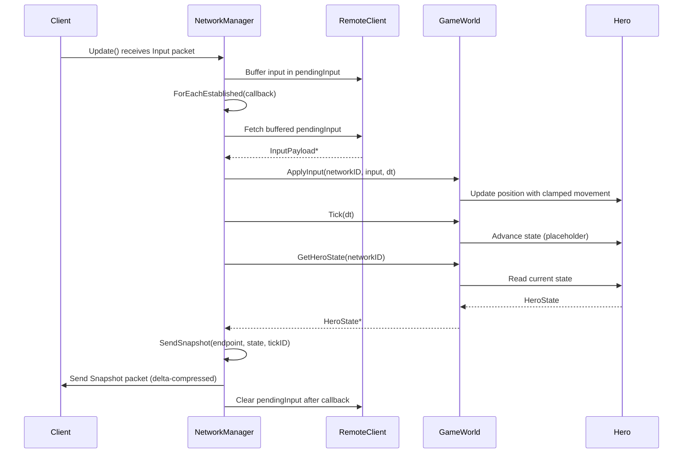

# DEV LOG — P-3.7 Minimal Game Loop

**Propuesta:** P-3.7 Minimal Game Loop — Input → GameWorld → Snapshot
**Fecha:** 2026-03-23

---

## ¿Qué problema resolvíamos?

Tras P-3.6 teníamos un servidor completamente funcional a nivel de protocolo: handshake, reliability, RTT, delta compression, session recovery. Pero había un vacío fundamental: **el servidor no procesaba inputs ni enviaba estado de juego**.

Los bots enviaban `InputPayload` cada tick y el servidor los descartaba a través del data callback genérico sin hacer nada con ellos. La métrica de "Delta Efficiency: 99%" del benchmark P-4.3 era engañosa — el servidor solo enviaba heartbeats, no snapshots reales. No había movimiento, no había `HeroState` autoritativo, no había base para lag compensation.

P-3.7 cierra ese gap: primer juego real en el servidor.

---

## ¿Qué hemos construido?

| Componente | Dónde | Qué hace |
|-----------|-------|---------|
| **GameWorld** | `Core/GameWorld.h/.cpp` | Contenedor autoritativo de `ViegoEntity`. `ApplyInput` + anti-cheat + `Tick` |
| **pendingInput** | `RemoteClient` | Buffer de input por cliente, rellenado por `NetworkManager` al recibir `PacketType::Input` |
| **m_lastClientAckedServerSeq** | `RemoteClient` | Última seq del servidor confirmada por el cliente (desde `header.ack`). Para selección de baseline delta |
| **ForEachEstablished** | `NetworkManager` | Itera clientes no-zombie, expone input, lo limpia tras callback |
| **SendSnapshot** | `NetworkManager` | `[tickID:32][delta/full HeroState]` con baseline por ACK confirmado |
| **Game loop 5 pasos** | `Server/main.cpp` | `Update → ApplyInputs → Tick → SendSnapshots → ++tickID` a 100Hz |
| **16 tests** | `GameWorldTests.cpp` | Cobertura de movimiento, anti-cheat, bounds, tickID, ForEachEstablished |

---

## El flujo completo tick a tick



---

## La decisión de diseño más importante: ¿dónde interceptar los Input packets?

El handoff de Gemini proponía dos opciones:
1. Interceptar en `NetworkManager::Update()` — el middleware bufferea el input directamente
2. Dejar llegar al data callback en `main.cpp` y bufferear allí

Elegimos la opción 1 por tres razones:
- **Consistencia**: `Heartbeat` ya se cortocircuitaba dentro de `NetworkManager` (línea 140 antes del PR). Input sigue el mismo patrón.
- **`main.cpp` limpio**: el servidor no necesita parsear `PacketType::Input` — solo llama `ForEachEstablished` y recibe `InputPayload*` ya deserializado.
- **Testeable aislado**: el test `ForEachEstablished_ReceivesBufferedInput` verifica el pipeline completo sin tocar `main.cpp`.

El coste: `NetworkManager` ahora tiene conocimiento de `InputPayload`. Aceptable porque ya tenía conocimiento de todos los demás tipos de paquete de protocolo.

---

## Anti-cheat: modelo autoritativo vs relay

La lección directa del proyecto legacy AA4 aplicada aquí.

**AA4 (relay model):** El cliente enviaba su posición. El servidor validaba que la velocidad entre posición anterior y nueva no superara `MAX_SPEED_X=150`. Problema: si el cliente miente su posición poco a poco, el servidor acepta cada step individualmente.

**P-3.7 (authoritative model):** El cliente envía solo su **intención normalizada** `[-1, 1]`. El servidor calcula la posición usando `kMoveSpeed × dt`. No hay posición recibida del cliente — los ataques de teletransporte son imposibles a nivel de protocolo.

```cpp
const float dx = std::clamp(input.dirX, -1.0f, 1.0f);
const float newX = std::clamp(hero.GetX() + dx * kMoveSpeed * dt, -kMapBound, kMapBound);
```

El test `AntiCheat_InputClamped_OverNormalized` verifica que `dirX=999` produce el mismo desplazamiento que `dirX=1.0`.

---

## Nota de diseño: movimiento diagonal y sqrt(2)

CodeRabbit señaló correctamente que con `dirX=1, dirY=1`, la velocidad resultante es `sqrt(2) × kMoveSpeed ≈ 141 u/s` en lugar de 100 u/s.

**Decisión consciente: no normalizamos el vector de dirección.**

Razón: en los MOBAs de referencia (League of Legends, Dota 2) el movimiento diagonal es marginalmente más rápido. Los jugadores experimentados lo conocen y es parte del juego. Normalizar el vector haría el movimiento estrictamente uniforme pero divergiría del comportamiento estándar del género.

Si en el futuro se quiere velocidad uniforme, la corrección es simple:

```cpp
const float len = std::sqrt(dx * dx + dy * dy);
const float ndx = (len > 0.001f) ? dx / len : 0.f;
const float ndy = (len > 0.001f) ? dy / len : 0.f;
```

Documentado como comportamiento esperado, no como bug.

---

## SendSnapshot — por qué RecordSnapshot va antes de Send()

Un detalle de implementación que requirió cuidado:

```cpp
const uint16_t usedSeq = client.seqContext.localSequence;
// ...
client.RecordSnapshot(usedSeq, state);  // ← ANTES de Send()
Send(to, payload, PacketType::Snapshot);  // ← AdvanceLocal() ocurre aquí
```

`Send()` llama internamente a `seqContext.AdvanceLocal()`. Si grabáramos el snapshot **después** de `Send()`, `localSequence` ya habría avanzado al siguiente valor. El snapshot quedaría indexado con una seq incorrecta, y `GetBaseline` nunca lo encontraría.

Capturar `usedSeq` antes y grabar antes de `Send()` garantiza que el slot del buffer circular coincide exactamente con el número que irá en el header del paquete.

---

## ForEachEstablished — doble llamada en el game loop

El loop en `main.cpp` llama `ForEachEstablished` dos veces:

```cpp
// 1ª llamada: apply inputs
manager.ForEachEstablished([&](uint16_t id, const EndPoint&, const InputPayload* input) {
    if (input) gameWorld.ApplyInput(id, *input, kFixedDt);
});

gameWorld.Tick(kFixedDt);

// 2ª llamada: send snapshots
manager.ForEachEstablished([&](uint16_t id, const EndPoint& ep, const InputPayload*) {
    const auto* state = gameWorld.GetHeroState(id);
    if (state) manager.SendSnapshot(ep, *state, tickID);
});
```

La primera llamada consume y limpia `pendingInput`. La segunda recibe `nullptr` por diseño — no necesita el input, solo lee el estado del `GameWorld` ya actualizado.

Constraint documentado: el callback no debe añadir ni eliminar clientes de `m_establishedClients`. La iteración es sobre el map directamente. En el uso actual de `main.cpp` esto es seguro; si en el futuro el callback necesita modificar el mapa, hay que iterar sobre una copia de las keys.

---

## Wire format — snapshot payload

```
[ tickID:    32 bits ]  ← prefijo para lag compensation (Fase 5.3)
[ HeroState: variable ] ← SerializeDelta o Serialize según baseline disponible
```

| Escenario | Bits totales | Bytes |
|---|---|---|
| Full sync (sin baseline confirmada) | 32 + 149 = 181 bits | ~23 bytes |
| Delta sin cambios | 32 + 38 = 70 bits | ~9 bytes |

Los 9 bytes del caso sin cambios incluyen: tickID (4B) + networkID (4B) + 6 dirty-flags (6 bits). La nota de Gemini en la validación: *"Es una de las implementaciones de delta-compression más eficientes que he visto para un TFG"*.

---

## Tests clave y lo que validan

| Test | Qué valida |
|------|------------|
| `ApplyInput_MovesHeroExactly` | 10 ticks a (1,0), dt=0.01 → x=10.0 exacto |
| `AntiCheat_InputClamped_OverNormalized` | dirX=999 → desplazamiento idéntico a dirX=1.0 |
| `AntiCheat_ClampsToBounds` | 600 ticks en dirección +X → clampeado a kMapBound=500 |
| `SendSnapshot_ContainsTickID` | Handshake completo → SendSnapshot(42) → los primeros 32 bits del payload = 42 |
| `SendSnapshot_TickIDIncrements` | 5 llamadas con tick=0..4 → cada snapshot contiene el tick correcto |
| `ForEachEstablished_InputClearedAfterCallback` | Segunda llamada devuelve nullptr — el input de la fase de Apply no contamina la fase de Snapshot |
| `ForEachEstablished_MultipleClients_PartialInput` | 2 clientes, solo uno envía input → el otro recibe nullptr |

---

## Resultado

- 156/156 tests, sin regresiones
- El servidor ahora tiene estado de juego real: héroes que se mueven, posiciones autoritativas, snapshots delta con tickID
- Base sólida para Fase 5: el `tickID` en cada snapshot es el ID de reconciliación que necesita el lag compensation
- Lección del legacy aplicada: el cliente nunca dice dónde está, solo adónde quiere ir
