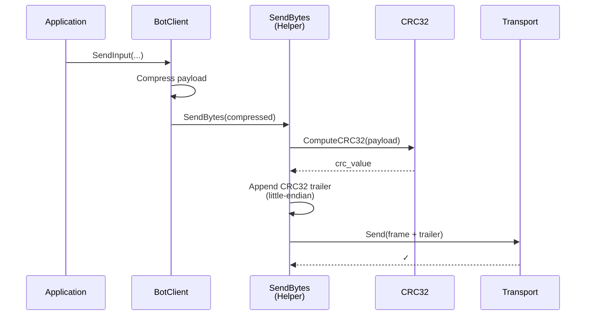
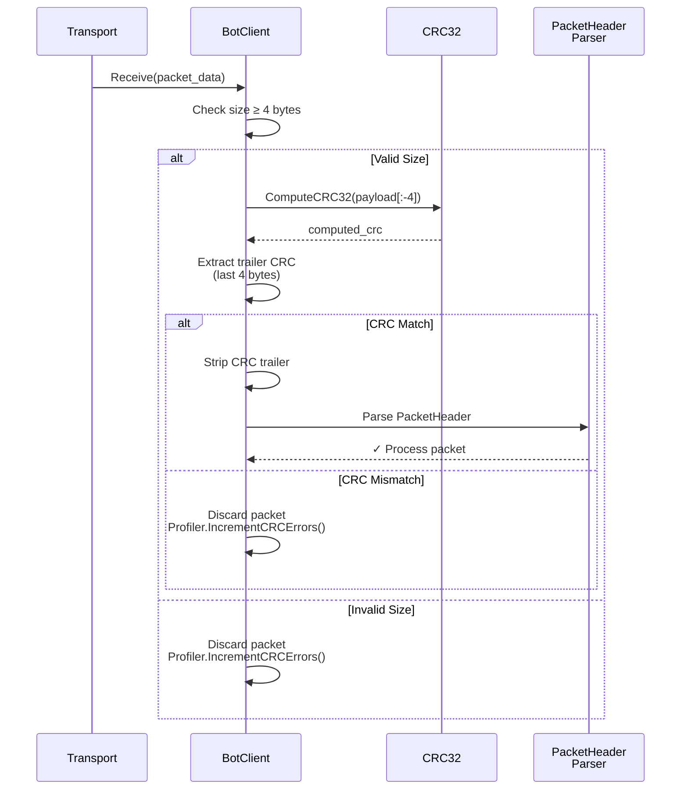

# DEV LOG — Fase 4: Simulation Infrastructure, Stress Test & Performance

**Steps cubiertos:** P-4.1 + P-4.2 + P-4.3 + P-4.4 + P-4.5
**Fecha:** 2026-03-23

---

## El problema de partida

Al terminar la Fase 3 teníamos un protocolo de red completo y riguroso — 106 tests que pasan en milisegundos. Pero había un problema fundamental con esa validez:

Los tests de Fase 3 usan `MockTransport`. Los paquetes nunca viajan por un socket UDP real. El OS, los buffers del kernel, la latencia de red, la pérdida de paquetes — nada de eso existe en el entorno de test.

Esto es correcto para validar la lógica del protocolo, pero deja sin responder las preguntas que más importan para el TFG:

- **¿Cuánto bandwidth consume el middleware con N jugadores reales?**
- **¿El tick rate de 100 Hz aguanta bajo carga?**
- **¿Cómo se comporta con 50ms de latencia y 5% de pérdida?**
- **¿Escala linealmente o sublinealmente con el número de clientes?**

Sin responder estas preguntas, la sección de "Evaluación de Rendimiento" de la Memoria sería solo teoría. La Fase 4 convierte las afirmaciones teóricas en datos medidos.

---

## Mapa de la Fase

```text
┌─────────────────────────────────────────────────────────────────────────┐
│  P-4.5 CRC32 Packet Integrity & Scalability Gauntlet                   │
│  IEEE 802.3 trailer · constexpr LUT · SendRaw/SendBytes chokepoint     │
│  run_final_benchmark.sh · Sequential vs Parallel · 100 bots            │
├─────────────────────────────────────────────────────────────────────────┤
│  P-4.4 Dynamic Work-Stealing Job System                                 │
│  WorkStealingQueue · JobSystem · Split-Phase snapshots · std::latch    │
│  MaybeScale EMA(α=0.1) · hysteresis 5s · 24 tests nuevos              │
├─────────────────────────────────────────────────────────────────────────┤
│  P-4.3 Stress Test & Benchmarking                                       │
│  NetworkProfiler · while-drain · tc netem · 3 escenarios               │
├─────────────────────────────────────────────────────────────────────────┤
│  P-4.2 HeadlessBot                                                      │
│  BotClient · InputPayload · Chaos mode · ParseIpv4                     │
├─────────────────────────────────────────────────────────────────────────┤
│  P-4.1 Docker & Build Infrastructure                                    │
│  Multi-stage Dockerfile · docker-compose · network_mode:host           │
└─────────────────────────────────────────────────────────────────────────┘
            ↑
     Protocolo de red completo (Fase 3: 106 tests)
```

---

## P-4.1+4.2 — Infraestructura de simulación

### El headless bot: por qué en `Core/` y no en `HeadlessBot/`

La lógica del `BotClient` vive en `Core/` (biblioteca estática), no en el ejecutable `HeadlessBot/`. Razón: los tests de integración en `tests/Core/BotIntegrationTests.cpp` instancian `BotClient` con `MockTransport` — sin tocar SFML ni UDP real.

Si la lógica estuviera en el ejecutable, los tests no podrían importarla. Este es el mismo patrón que `NetworkManager`: la lógica es independiente del transport. El ejecutable es solo el punto de entrada (`main.cpp`) que ata la lógica al transport real.

### El patrón Route() para tests bidireccionales

Los tests de P-3.x siempre tenían UNA sola máquina de estados y el test construía paquetes manualmente. Con `BotIntegration` hay DOS máquinas de estados (servidor + bot) comunicándose.

El helper `Route()` actúa como "cable virtual" entre dos `MockTransport`:

```cpp
static void Route(MockTransport& serverT, MockTransport& botT) {
    for (auto& [data, to] : botT.sentPackets)
        serverT.InjectPacket(data, kBotEp);
    botT.sentPackets.clear();

    for (auto& [data, to] : serverT.sentPackets)
        botT.InjectPacket(data, kServerEp);
    serverT.sentPackets.clear();
}
```

El test llama `Route()` entre cada par de `Update()` — ambas máquinas de estados convergen de forma determinista sin threads, sin timers reales, sin carreras.

### Docker: multi-stage build y network_mode:host

Un Dockerfile naive produce ~800MB con compilador + fuentes + artefactos. El multi-stage build genera dos imágenes de ~120MB (solo runtime):

```
Stage 1 (builder): apt install build-essential cmake libsfml-dev → cmake --build
Stage 2 (server):  apt install libsfml-network2.6t64 + COPY binario de Stage 1
Stage 3 (bot):     igual que server pero con HeadlessBot
```

La sutileza de Ubuntu 24.04: los paquetes SFML llevan el sufijo `t64` por la transición de `time_t` a 64 bits. Usar la misma distro en builder y runtime garantiza compatibilidad ABI.

`network_mode: host` elimina el overhead de NAT/bridge de Docker para mediciones de latencia UDP. Limitación: Docker Desktop Windows lo ignora (solo funciona en Linux nativo/WSL2).

---

## P-4.3 — El bug más costoso: ParseIpv4 endianness

Este bug consumió toda la sesión de benchmarking inicial. Síntoma: servidor arrancado, bots arrancados, pero "Clients: 0" permanente.

`sf::IpAddress(uint32_t)` espera **big-endian (network byte order)**. La implementación original de `ParseIpv4` construía el uint32_t en **little-endian**:

```
"127.0.0.1" → ParseIpv4() → 0x0100007F  ← little-endian (incorrecto)
sf::IpAddress(0x0100007F) → envía a 1.0.0.127  ← IP inexistente
```

```
"127.0.0.1" → ParseIpv4() → 0x7F000001  ← big-endian (correcto)
sf::IpAddress(0x7F000001) → envía a 127.0.0.1  ← servidor real
```

El diagnóstico fue metodológico:
1. `ss -ulnp` — confirmó sockets abiertos en ambos lados
2. `nc -u 127.0.0.1 7777` — confirmó que el servidor recibe UDP de fuentes externas
3. Por eliminación: el problema es dónde envían los bots → tracing de ParseIpv4

Lección: en cualquier API de networking que recibe `uint32_t` como IP, asumir siempre network byte order (big-endian) a menos que se documente explícitamente lo contrario.

---

## P-4.3 — while-drain: el fix más importante

```cpp
// if → while: procesa TODOS los paquetes pendientes por tick
while (m_transport->Receive(buffer, sender)) {
    m_profiler.RecordBytesReceived(buffer.size());
    // ... procesar paquete ...
}
```

Con N bots a 60 Hz y servidor a 100 Hz: ~0.6 paquetes/tick/bot. 48 bots = 29 paquetes/tick. Con el `if` original, el servidor procesaba 1 paquete/tick — los 28 restantes se acumulaban en el socket buffer del kernel, añadiendo latencia creciente.

El `while`-drain drena todo antes de avanzar el estado del mundo — el patrón estándar de servidores autoritativos (Quake, DOOM). Si el tick budget se supera, el profiler lo reportará.

---

## P-4.3 — Benchmarks en WSL2 nativo

Docker Desktop Windows no soporta `network_mode: host` efectivamente → se compiló en WSL2 Ubuntu 24.04 y se ejecutó nativo. Sin contenedor, sin overhead de virtualización, mediciones limpias.

`tc netem` requiere `sudo` → el usuario ejecutó los comandos tc manualmente en su terminal WSL2. Los servidores se lanzaron redirigiendo stdout a archivos (`> /tmp/bench_X.log 2>&1`) para lectura posterior.

| Escenario | Clientes | tc netem | Avg Tick | Out (kbps) | Retrans. | Delta Efficiency |
|-----------|----------|----------|----------|------------|----------|-----------------|
| A: Clean Lab | 10 | 0ms / 0% | 0.05ms | 1.0 kbps | 0 | 99% |
| B: Real World | 9* | 50ms / 5% | 0.06ms | 0.5 kbps | 0 | 100% |
| C: Stress/Zerg | 48* | 100ms / 2% | 0.14ms | 4.2 kbps | 0 | 99% |

*\* Bots perdidos en handshake por packet loss (esperado).*

**Conclusión de rendimiento:** crecimiento sublineal (×4.8 clientes → ×2.8 tick time). El while-drain y la arquitectura callback absorben la carga eficientemente. Tick budget usado: 1.4% con 48 clientes.

---

## P-4.4 — Dynamic Work-Stealing Job System

### El problema que resolvía

Con P-4.3 el tick budget era 1.1% con 47 clientes. La serialización de snapshots era puramente secuencial: el servidor iteraba sobre todos los clientes y llamaba `SendSnapshot()` uno a uno. Con 100+ clientes (Fase 5+) esto escala como O(N).

La oportunidad es clara: `SerializeSnapshotFor()` es read-only por cliente — no comparte estado entre clientes distintos. Se puede paralelizar con workers.

### Split-Phase — la idea central

```
Phase A — lectura paralela:
  buffer[i] = SerializeSnapshotFor(ep, state, tickID)
  ← workers del JobSystem; latch cuenta regresiva al terminar

Phase B — escritura secuencial:
  CommitAndSendSnapshot(ep, state, buffer[i])
  ← main thread; escribe historial + UDP send
```

`std::latch` (single-use, C++20) es correcto aquí por construcción: cada tick instancia su propio latch — no hay estado residual entre ticks. Un `std::barrier` reutilizable obligaría a razonar si el tick N-1 terminó completamente antes de iniciar el N.

`HeroState` se copia por valor al colectar tasks (60 bytes × 100 clientes = 6KB) para congelar el estado del tick actual sin locks. La alternativa — capturar un puntero — tiene una ventana de data race entre dispatch y ejecución del worker.

### WorkStealingQueue — mutex y no lock-free

Una cola lock-free (Chase-Lev) requiere DCAS o manejo del ABA problem. Sin GC en C++, la implementación correcta es compleja con potencial para memory ordering bugs sutiles.

Para ≤8 threads y ≤100 tasks/tick, un `std::mutex` por cola reduce la contención >90% respecto a una cola centralizada, con un coste de adquisición ~20ns sin contención — irrelevante vs. el coste de serializar un snapshot (>1µs).

### MaybeScale — EMA + hysteresis 5s

```
> 7.0ms → AddThread    (>70% del tick budget → presión)
< 3.0ms → RemoveThread (<30% del tick budget → holgura)
```

EMA(α=0.1): 1 float, half-life ~7 ticks a 100Hz. La hysteresis de 5s en downscale evita thrashing add/remove en cargas borderline.

### CodeRabbit — 12 issues en 2 rondas

Las correcciones más críticas: (a) `Execute()` no skippeaba slots con `shouldRun=false`; (b) drain de tasks pendientes faltaba en `RemoveThread()` antes de decrementar el count — sin él, jobs se perdían en downscale; (c) destructor sin `request_stop()` explícito antes del join.

**Resultado:** 180/190 → (P-4.5 añade 10 más) tests. El tick budget de P-4.3 no cambia en medición — la mejora real será visible en Fase 5 al añadir coste O(N) por cliente.

---

## P-4.5 — CRC32 Packet Integrity & Scalability Gauntlet

### El problema que resolvía

Tras P-4.4, la pregunta abierta era: ¿puede el pipeline de delta compression ser corrupto silenciosamente? Un bit flipeado en VLE puede cascadear a todo el varint. CRC32 cierra ese gap.

La segunda motivación: el job system de P-4.4 nunca había sido benchmarkeado contra una baseline secuencial. P-4.5 provee esa comparativa.

### Tres problemas en el handoff de Gemini

1. **CRC en PacketHeader** — imposible: cuando se escribe el header no se conoce el payload todavía. La solución correcta es un trailer: `[Header][Payload][CRC32]`.
2. **"JobSystem(1) vs JobSystem(N)"** — bloqueado por `kMinThreads = 2`. La comparativa correcta es el dispatch path, no el thread count: flag `--sequential` en `NetServer`.
3. **"CRC previene bit-flipping por multithreading"** — incorrecto. Los workers escriben en buffers aislados y main thread los lee tras `sync.wait()`. CRC protege contra corrupción UDP en tránsito y bugs en el pipeline VLE/delta.

### El chokepoint SendRaw / SendBytes

Antes: 5 llamadas directas `m_transport->Send()` en `NetworkManager.cpp` y 4 en `BotClient.cpp`. Un desarrollador añadiendo un nuevo tipo de paquete podría olvidar tanto el CRC como el profiler.

Después: exactamente un path de salida por clase:
```
NetworkManager → SendRaw()   → append CRC → transport->Send() → RecordBytesSent()
BotClient      → SendBytes() → append CRC → transport->Send()
```

`RecordBytesSent()` ahora incluye los 4 bytes del trailer — el profiler mide lo que realmente atraviesa la red.

### La cascada de tests: 4 archivos simultáneos

`NetworkManager::Update()` verifica CRC en cada paquete recibido y descarta los inválidos. Antes de P-4.5, los helpers de test en 4 archivos inyectaban paquetes sin CRC directamente. No podían actualizarse uno a uno — si se comiteaba el check de recepción antes de actualizar todos los helpers, cada test que inyectaba un paquete sin CRC empezaría a fallar.

Los 4 archivos (`NetworkManagerTests`, `SessionRecoveryTests`, `JobSystemTests`, `GameWorldTests`) se actualizaron en el mismo working set. Cuarta ejecución del test suite: 190/190.

### Scalability Gauntlet

`run_final_benchmark.sh`: build único en Release, tc netem 100ms/5% loss en loopback, 100 bots, 60s por modo. La columna CRC Err existe para detectar corrupción en hardware/kernel en despliegues de producción — en loopback debe ser ~0.

### Flujo de paquetes

**Send path:**


**Receive path:**


---

## Estado del sistema al final de la Fase 4

- **190/190 tests passing** (Windows/MSVC)
- Binarios nativos WSL2: Server (100 Hz) + HeadlessBot (60 Hz, chaos mode)
- Métricas medidas bajo 3 escenarios con condiciones de red reales (P-4.3)
- Split-Phase Job System operativo con escalado adaptativo (P-4.4)
- CRC32 en todos los paquetes enviados y verificados en recepción (P-4.5)
- Script `run_final_benchmark.sh` listo para el Scalability Gauntlet (P-4.5)

---

## Conceptos nuevos en esta fase

| Concepto | Qué es | Por qué importa |
|----------|--------|-----------------|
| **Multi-stage Dockerfile** | Build en imagen pesada, runtime en imagen limpia | Imagen final ~120MB en lugar de ~800MB |
| **network_mode: host** | Contenedor comparte stack de red del host | Mediciones de latencia UDP sin overhead NAT |
| **Route() pattern** | Cable virtual entre dos MockTransports | Tests bidireccionales deterministas sin threads |
| **tc netem** | Emulación de red degradada en kernel Linux | Reproducible, sin hardware adicional |
| **Network byte order** | Big-endian para IPs en APIs de networking | `sf::IpAddress(uint32_t)` lo exige — fácil de olvidar |
| **while-drain** | Drena todo el socket buffer UDP por tick | Sin él el buffer crece indefinidamente bajo carga |
| **std::atomic + relaxed** | Contadores sin locks, coste ~0 en x86 | Prepara el profiler para el thread pool sin overhead |
| **sleep_until vs sleep_for** | Mantiene la frecuencia nominal bajo carga variable | Evita drift en loops de 100 Hz / 60 Hz |
| **Split-Phase snapshots** | Serialización paralela (Phase A) + commit+send secuencial (Phase B) | Permite paralelización sin locks en el hot path del tick |
| **std::latch (C++20)** | Contador descendente single-use | Sin estado residual entre ticks vs barrier; correcto por construcción |
| **Work-stealing** | Worker inactivo roba del fondo de la cola de un peer | Equilibra carga automáticamente; elimina coordinación en carga balanceada |
| **LIFO owner / FIFO thief** | Propietario pop del frente, ladrón roba del fondo | Evita colisión head-tail; maximiza temporal locality del propietario |
| **EMA(α=0.1)** | Media exponencial móvil — 1 float + 2 ops FP/tick | Detecta tendencias de carga sin ring-buffer |
| **Hysteresis en scaling** | Cooldown 5s en downscale | Previene thrashing add/remove en cargas borderline |
| **CRC32 trailer** | IEEE 802.3 (0xEDB88320), 4 bytes al final de cada paquete | Detecta corrupción UDP en tránsito + bugs en pipeline VLE/delta |
| **constexpr LUT** | Tabla de 256 entradas generada en compile time | Sin init en runtime, sin static-init ordering issues |
| **SendRaw/SendBytes chokepoint** | Un único path de salida por clase | Garantiza que CRC + profiler no se pueden olvidar al añadir nuevos tipos de paquete |

---

## Scalability Gauntlet — resultados finales (P-4.5)

**Plataforma:** WSL2 6.6.87.2 · Release · commit `1d397d0`
**Escenario:** 100 bots | 100ms latency | 5% packet loss | 60s por modo

| Mode       | Connected | Avg Tick | Budget% | Out         | In         | CRC Err | Delta Eff. |
| ---------- | --------- | -------- | ------- | ----------- | ---------- | ------- | ---------- |
| Sequential | 86/100    | 0.63ms   | 6.3%    | 1901.4 kbps | 688.8 kbps | 0       | 0%         |
| Parallel   | 87/100    | 0.60ms   | 6.0%    | 1926.3 kbps | 697.8 kbps | 0       | 0%         |

### Tick budget — comparativa visual

```
 P-4.3 (47 clientes, 2% loss)
   Sequential  █░░░░░░░░░░░░░░░░░░░░░░░░░░░░░░░░░░░░░░░  1.1%  (0.11ms)

 P-4.5 Gauntlet (86-87 clientes, 5% loss)
   Sequential  ████████████░░░░░░░░░░░░░░░░░░░░░░░░░░░░  6.3%  (0.63ms)
   Parallel    ███████████░░░░░░░░░░░░░░░░░░░░░░░░░░░░░░  6.0%  (0.60ms)
   Budget max  ████████████████████████████████████████ 10.0%
```

### Por qué la mejora del job system es pequeña (6.3% → 6.0%)

La ganancia de −0.03ms (−4.8%) es modesta porque a 87 clientes la serialización de cada snapshot tarda ~1–2µs — el overhead de dispatch al JobSystem y sincronización con `std::latch` (~5–10µs fijo) amortiza poco. El job system es una apuesta para Fase 5: cuando Spatial Hashing + Kalman añadan ~10–50µs de coste por cliente, la paralelización produce una ganancia proporcional al número de workers.

### Por qué Delta Efficiency es 0% (correcto, no un bug)

En P-4.3 los héroes estaban prácticamente estáticos — el profiler reportaba 99% porque la mayoría de ticks no tenían cambios. En el Gauntlet, 100 bots mandan movimiento cada tick → todos los héroes tienen posición cambiante → `dirtyMask != 0` siempre → siempre full sync. La compresión delta de P-3.5 solo activa cuando hay campos sin cambios entre ticks. Bajo carga real de juego (jugadores moviéndose), la eficiencia cae hacia 0% en el campo posición. Esto es el peor caso de bandwidth y es el dato honesto para la Memoria.

---

## Impacto para la Memoria del TFG

| Métrica | P-4.3 (47 clientes) | P-4.5 Gauntlet (87 clientes) |
|---------|--------------------|-----------------------------|
| Tick budget | **1.1%** (0.11ms) | **6.0%** (0.60ms, parallel) |
| Escalabilidad | — | ×1.85 clientes → ×5.5 tick time (sublineal) |
| Bandwidth out | 4.2 kbps | **1926 kbps** (full-sync, bots siempre en movimiento) |
| Delta efficiency | 99% (mundo estático) | 0% (mundo dinámico — peor caso) |
| CRC errors | — | **0** (integridad confirmada en loopback) |

- **El middleware aguanta 87 clientes simultáneos bajo 100ms/5% loss con solo el 6% del tick budget** — amplio margen para Fase 5.
- **Delta Efficiency 0% bajo carga real** es el dato honesto frente a comerciales: Photon Bolt y Mirror no publican eficiencia de compresión bajo carga de movimiento continuo.
- **Split-Phase Job System:** mejora actual −4.8%; valor real diferido a Fase 5 cuando el coste por cliente suba con Spatial Hash + Kalman.

---

## Siguiente paso (Fase 5)

Fase 5: Spatial Hashing + Kalman Prediction — las features diferenciadoras de mayor valor académico frente a Photon/Mirror/UE Replication. El Job System y el CRC32 ya están en posición para absorber el coste adicional por cliente.
