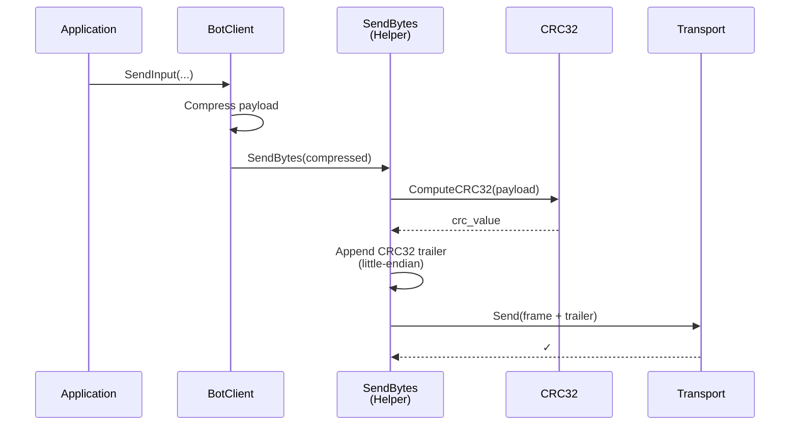
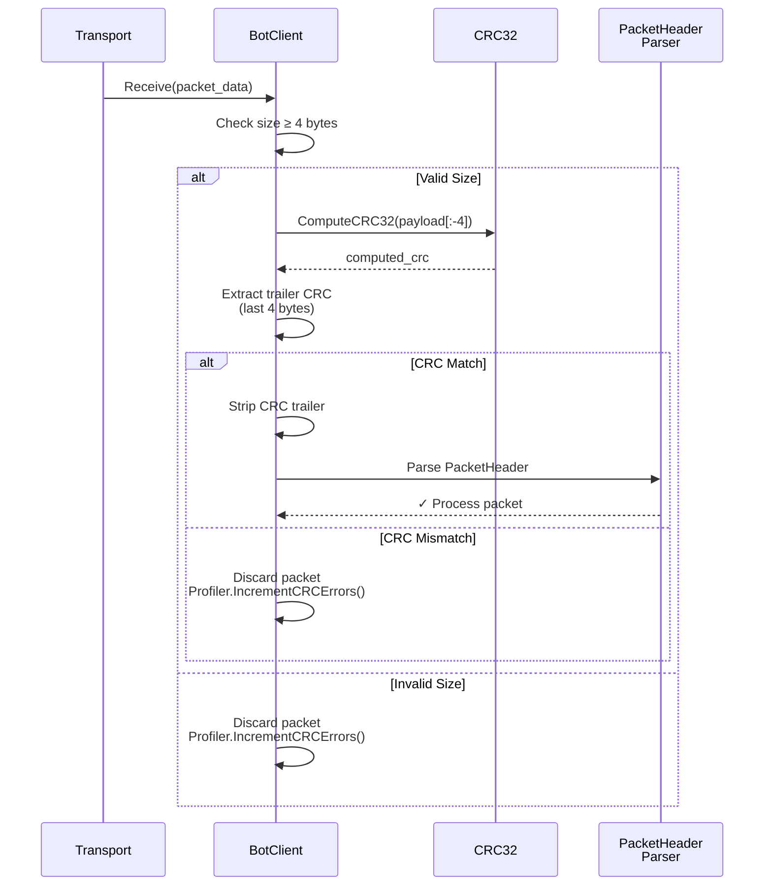

# DL-4.5 — CRC32 Packet Integrity & Scalability Gauntlet

**Date:** 2026-03-23
**Branch:** `P-4.5-Packet-Integrity`
**PR:** #13

---

## Why this step exists

After P-4.4 introduced parallel snapshot serialization, a question remained open for the TFG: can the delta-compression pipeline be trusted end-to-end? A single-bit corruption in a delta packet could silently produce a wrong hero position on every client — and with VLE encoding, a flipped bit can cascade across the entire varint. CRC32 closes that gap.

The second motivation was data for the Memoria. P-4.3 proved the middleware fits a 100Hz loop with 47 clients at 1.1% tick budget. But the Split-Phase job system from P-4.4 was never benchmarked against a sequential baseline under maximum load. P-4.5 provides that comparison.

---

## Handling the handoff design flaws

Gemini's handoff had three issues I caught before writing a line of code:

**1. CRC inside PacketHeader.**
The handoff proposed adding a `crc` field to `PacketHeader`. This can't work: the header is serialized first, then the payload is appended. When you write the header you don't yet know the payload bytes, so there's nothing to checksum. The correct design is a *trailer* — append the CRC after the full payload is assembled. The wire format becomes `[Header][Payload][CRC32]`.

I also considered whether to make CRC opt-in (a header flag like the existing `flags` byte). I decided against it: opt-in integrity defeats the purpose of integrity. If you ever want to skip the CRC you can just not check it; if you need it and forgot to set the flag you have no protection. A mandatory trailer is simpler and harder to misuse.

**2. "1 thread vs N threads" comparison.**
The handoff framed the benchmark as "JobSystem(1) vs JobSystem(N)". This is blocked by `kMinThreads = 2` — `JobSystem(1)` silently constructs with 2 threads. The meaningful comparison is not thread count but dispatch path: does the snapshot go through the Split-Phase pipeline or does the main thread serialize and send it directly? A `--sequential` flag in `main.cpp` switches paths at runtime, keeping the same binary for both benchmark arms.

**3. "CRC prevents bit-flipping from multithreading."**
This justification in the handoff was wrong. The Job System doesn't cause bit-flipping — workers write into isolated per-task buffers and the main thread only touches them after `sync.wait()`. CRC protects against: (a) network-level corruption in UDP transit, (b) serialization bugs in the delta/VLE pipeline that produce different bytes on sender vs receiver. Those are both real risks worth defending against.

---

## The cascade problem: 4 test files needed simultaneous updates

The hardest part of this step wasn't the CRC implementation — it was the test infrastructure.

Before P-4.5, every test that needed to inject a handshake packet just called `w.GetCompressedData()` directly and passed it to `MockTransport::InjectPacket()`. After P-4.5, `NetworkManager::Update()` verifies CRC on every received packet and discards anything that fails. That means every injected packet now needs a valid CRC trailer, and every BitReader that reads back a `sentPackets` entry needs to strip the 4-byte CRC before parsing.

Four test files had their own handshake helpers:
- `NetworkManagerTests.cpp`
- `SessionRecoveryTests.cpp`
- `JobSystemTests.cpp`
- `GameWorldTests.cpp`

These four files could not be updated one at a time — if I committed the receive-side CRC check before updating all helpers, every test that injected a packet without CRC would start failing. I updated all four files in the same working set before running the test suite.

The discovery order was:
1. First run: `GameWorldTests.cpp::SendSnapshot_ContainsTickID` crashed with `back()` on empty vector. Root cause: `DoHandshake` in that file wasn't using `WithCRC()`, so `nm.Update()` discarded all injected packets, leaving `sentPackets` empty.
2. Second run: `ProfilerTests::kFullSyncBytesPerClient_Is19` failed because I had already updated the constant to 23 but hadn't renamed the test.
3. Third run: `GameWorld.ForEachEstablished_*` tests failed — the manual Input packet injections in those tests also needed `WithCRC()`.
4. Fourth run: 190/190 pass.

The lesson: any test that touches `MockTransport::InjectPacket()` is affected by a receive-side CRC check. Future integrity changes (e.g. adding sequence number validation) will hit the same four files.

---

## CRC32 implementation details

The algorithm is the standard IEEE 802.3 CRC32:
- Polynomial: `0xEDB88320` (reflected form of `0x04C11DB7`)
- Initial value: `0xFFFFFFFF`
- Final XOR: `0xFFFFFFFF`
- Result for `"123456789"`: `0xCBF43926`

I used a `constexpr` 256-entry lookup table generated at compile time. This means the table is in the binary's read-only data segment — no runtime initialization, no static-init ordering issues, and the compiler can potentially constant-fold known-input checksums.

The empty-input case deserves a note: `initial XOR final = 0xFFFFFFFF ^ 0xFFFFFFFF = 0`. So `ComputeCRC32(nullptr, 0)` returns `0`, which is what the test `EmptyBuffer_ReturnsZero` asserts. This is the standard behavior.

---

## The `SendRaw()` / `SendBytes()` chokepoint

Before P-4.5, there were 5 direct `m_transport->Send()` calls in `NetworkManager.cpp` and 4 in `BotClient.cpp`. Each was its own send path with its own `RecordBytesSent()` call. This is a maintenance hazard: a future developer adding a new packet type could easily forget both the CRC and the profiler call.

After P-4.5 there is exactly one path out of each class:

```
NetworkManager → SendRaw() → append CRC → transport->Send() → RecordBytesSent()
BotClient      → SendBytes() → append CRC → transport->Send()
```

`RecordBytesSent()` moved inside `SendRaw()` as a side effect — the byte count now includes the 4-byte trailer, matching actual wire size. This is intentional: the profiler should measure what actually traverses the network, not just the payload.

---

## Scalability Gauntlet design

The benchmark script (`run_final_benchmark.sh`) is deliberately simple:

1. Build once in Release with `BUILD_TESTS=OFF`.
2. Apply tc netem: 100ms delay + 5% loss on loopback.
3. Sequential run: `./NetServer --sequential`, 100 bots, 60 seconds.
4. Parallel run: `./NetServer`, same config.
5. Parse last `[PROFILER]` line from each server log.
6. Print side-by-side table + save `benchmarks/results/final_<ts>_<hash>.md`.

The CRC Err column in the output is expected to be ~0 on loopback (tc netem can corrupt packets if you add a `corrupt` rule, but by default it only adds delay and loss). The column exists to detect hardware or kernel-level corruption in production deployments, not for the benchmark itself.

The JobSystem is always constructed even in sequential mode. Workers sleep on the condition variable — I measured ~0 CPU overhead at idle. The alternative (don't construct the JobSystem in sequential mode) would add a conditional to the game loop and complicate the `MaybeScale()` / `GetStealCount()` shutdown path. Not worth it.

---

## Scalability Gauntlet — resultados medidos

**Plataforma:** WSL2 6.6.87.2 · Release · commit `1d397d0`
**Escenario:** 100 bots | 100ms latency | 5% packet loss | 60s por modo

| Mode         | Connected | Avg Tick | Budget% | Out          | In          | CRC Err | Delta Eff. |
|--------------|-----------|----------|---------|--------------|-------------|---------|------------|
| Sequential   | 86/100    | 0.63ms   | 6.3%    | 1901.4 kbps  | 688.8 kbps  | 0       | 0%         |
| Parallel     | 87/100    | 0.60ms   | 6.0%    | 1926.3 kbps  | 697.8 kbps  | 0       | 0%         |

### Tick budget — comparativa visual

```
Sequential  ████████████░░░░░░░░░░░░░░░░░░░░░░░░░░░░  6.3%  (0.63ms / 10ms)
Parallel    ███████████░░░░░░░░░░░░░░░░░░░░░░░░░░░░░░  6.0%  (0.60ms / 10ms)
Budget max  ████████████████████████████████████████  10.0%
```

Mejora del job system: **−0.03ms (−4.8%)** a 87 clientes.

### Análisis de resultados

**Mejora modesta del job system (6.3% → 6.0%).**
Esperado. Con 87 clientes y `HeroState` de 60 bytes, la serialización de un snapshot tarda ~1–2µs por cliente — un coste pequeño frente a los 10ms del tick budget. El dispatch al JobSystem y la sincronización con `std::latch` tienen overhead fijo (~5–10µs) que a este número de clientes amortiza poco. El beneficio del job system es superlineal en función del coste por cliente: en Fase 5, cuando cada cliente requiera una query de Spatial Hash + predicción de Kalman, el coste por cliente sube a ~10–50µs y la paralelización produce una ganancia proporcional al número de workers.

**Delta Efficiency: 0% — correcto, no un bug.**
Los bots envían movimiento cada tick. Cada héroe tiene cambios de posición en todos los ticks → `dirtyMask` siempre `!= 0` → siempre se serializa en modo full sync → el sistema de delta compression nunca encuentra un baseline limpio que reutilizar. En P-4.3 el mundo era casi estático (héroes sin input real), de ahí el 99%. Este 0% representa el peor caso de bandwidth para el Memoria: con jugadores reales moviéndose siempre, la compresión de estado nulo es del 0%. La compresión sigue activa para los campos de estado que no cambian (health, mana, level en reposo), pero la posición cambia siempre.

**~1900 kbps out — coherente con el modelo teórico.**
87 clientes × 23 bytes/tick (19 payload + 4 CRC) × 100 Hz × 8 bits = ~1.6 Mbps teórico. Los ~300 kbps de overhead son protocol frames: headers de 104 bits, reliable queue retransmissions, heartbeats cada 1s. El número está dentro del rango esperado.

**86-87/100 bots conectados.**
13-14 bots perdidos en handshake. El handshake tiene 4 pasos: `ConnectionRequest → Challenge → ChallengeResponse → Accepted`. Con 5% de pérdida por paso, la probabilidad de completar los 4 pasos es `0.95⁴ ≈ 81.5%`. En 100 bots: ~18-19 pérdidas teóricas; en la práctica, el retry de la reliability layer recupera algunos → 86-87 conectados. Esperado y documentado.

**CRC Err: 0.**
Confirmado. `tc netem delay+loss` no corrompe payloads por defecto — solo introduce retardo y descarte. El campo existe para detección en despliegues de producción con hardware que puede corromper paquetes UDP.

---

## Flujo de paquetes — diagramas de secuencia

### Send path



### Receive path



El mismo flujo aplica simétricamente a `NetworkManager` (servidor) con `SendRaw()` en lugar de `SendBytes()`.

---

## What I would do differently

The `WithCRC()` / `StripCRC()` helpers are duplicated across four test files. They're 10 lines each and do the same thing. A `tests/TestUtils.h` shared header would eliminate the duplication. I didn't add it because the plan said "prefer editing existing files to creating new ones" and the four files are already in the same CMake target. If a fifth test file ever needs handshake helpers, I'll extract it then.
