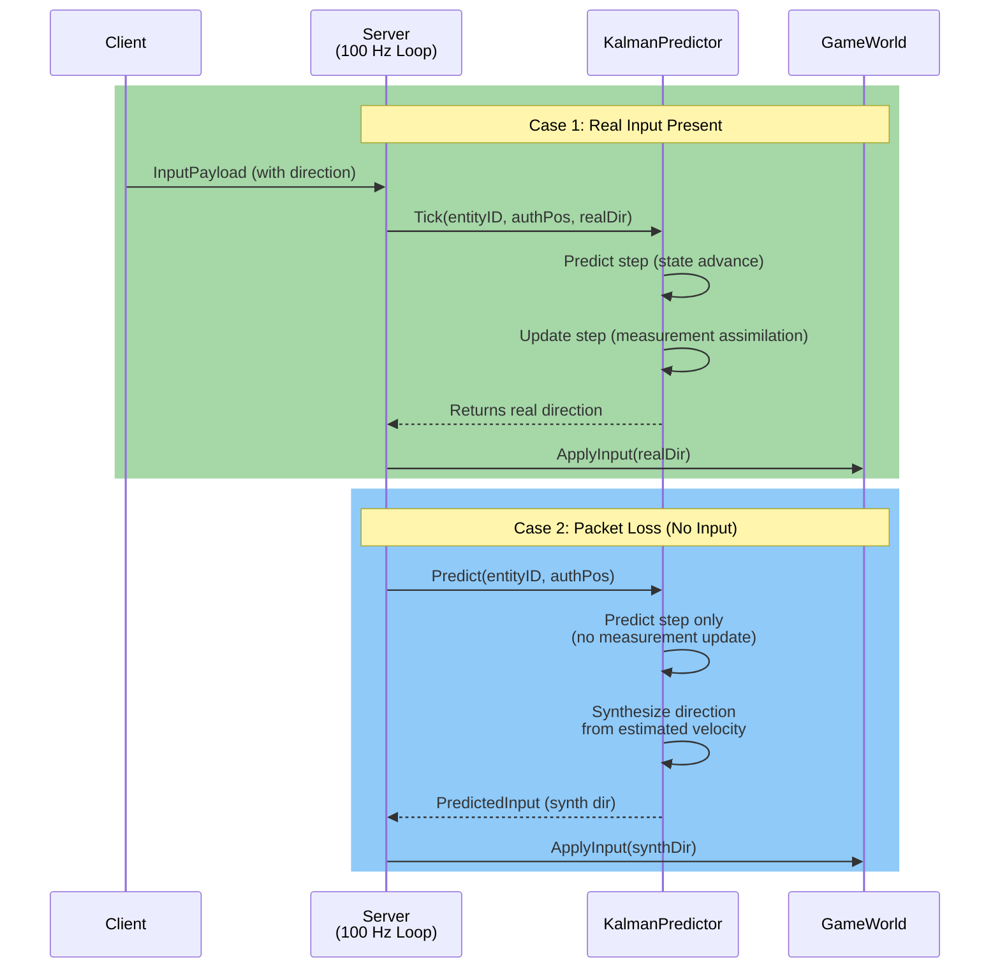

# DL-5.2 — Silent Server-Side Kalman Prediction

**Date:** 2026-03-24
**Branch:** `P-5.1-Spatial-Hashing-FOW`
**PR:** #16

---

## Why this step exists

P-3.7 established a 100 Hz authoritative game loop where the server applies one `InputPayload` per client per tick. That model breaks silently under packet loss: if a client's input fails to arrive, the server has no movement to apply and the entity freezes for that tick — even if the client is still moving locally. At 2% packet loss over a 100 Hz loop, this creates a freeze every ~0.5 seconds on average, which is perceptible in any competitive title.

The naive fix — carry-forward the last known input — works for a single missing tick but diverges over bursts because direction changes are ignored. P-5.2 replaces carry-forward with a Kalman filter: a principled estimator that tracks both position and velocity, synthesises a plausible direction on loss ticks, and self-corrects the moment real input resumes.

The secondary motivation is architectural: the feature must live in `Brain`, must not touch the wire format, and must be invisible to the client. Those three constraints forced every design decision that follows.

---

## How the Kalman filter integrates with the game loop



The call site in `main.cpp` step 2 is uniform — both paths deliver a direction to `GameWorld::ApplyInput`. The only difference is which branch of the filter ran.

---

## Filter design

**State vector:** `x = [px, py, vx, vy]ᵀ` — position and velocity in world units.

**Matrices (dt = 0.01 s, 100 Hz fixed tick):**

| Matrix | Value | Purpose |
|--------|-------|---------|
| `F` (4×4) | CV model with dt | State transition |
| `H` (2×4) | Position-only rows `[[1,0,0,0],[0,1,0,0]]` | Observation: measure `[px, py]` |
| `Q` (4×4) | `diag(0.001, 0.001, 5.0, 5.0)` | Process noise |
| `R` (2×2) | `0.015 × I₂` | Measurement noise (≈ 16-bit quantization step) |
| `P₀` (4×4) | `I₄` | Initial covariance |

**The key tuning decision is `Q_vel = 5.0`.** By making velocity process noise two orders of magnitude larger than position process noise (`Q_pos = 0.001`), the Kalman gain for the velocity states stays high enough that a 180° direction reversal is reflected in the velocity estimate within ~5–8 ticks (~50–80 ms). A lower `Q_vel` would cause the predictor to lag behind abrupt direction changes — which in a MOBA context means the synthetic input continues in the old direction for hundreds of milliseconds, drifting the predicted position far from the real one.

`R = 0.015 × I₂` is calibrated to the quantization step of the 16-bit position encoding (MAP ±500 m → ~1.53 cm/LSB). It tells the filter to trust measurements slightly less than the state prediction — appropriate because every `z_k` is an already-quantized value from `GameWorld`.

### Observation anchor

The authoritative `GameWorld` position is fed as the measurement `z_k = [x, y]` on every tick where real input arrives. This keeps the filter anchored to ground truth and prevents drift accumulation over long loss bursts. On loss ticks, `Predict` advances the state without a measurement update; the next real-input tick will correct via the standard update step.

### Matrix arithmetic — zero-allocation, zero-dependency

All 4×4 and 2×2 matrix operations (multiply, transpose, add, `mat22_inverse`) are fixed-size template helpers in an anonymous namespace inside `KalmanPredictor.cpp`. No heap allocation, no BLAS, no Eigen. `mat22_inverse` uses an explicit determinant formula with a degenerate-covariance guard: if `|det| < 1e-10`, the function falls back to predict-only (skips the update step) to avoid a division by zero from a near-singular innovation covariance.

---

## Module boundary decisions

### Brain has no dependency on MiddlewareShared

`PredictedInput` is a Brain-internal struct with two `float` fields. `main.cpp` converts it to `InputPayload` at the module boundary:

```cpp
InputPayload toApply{
    static_cast<int8_t>(pred.dirX * 127.0f),
    static_cast<int8_t>(pred.dirY * 127.0f),
    0
};
```

This enforces the one-way dependency rule: Brain → nothing. If Brain depended on MiddlewareShared, the `Brain` target would need the Shared headers, breaking the architecture diagram and complicating future extraction of Brain as a standalone library.

### Uniform call site in main.cpp

The game loop calls either `kalmanPredictor.Tick()` (real input) or `kalmanPredictor.Predict()` (loss), and both return a `PredictedInput`. The downstream `ApplyInput` call is identical in both branches. This was a conscious API choice: the alternative (having `Predict` write directly into an output parameter) would have required a second branch further down the loop, scattering the loss-handling logic.

### No wire-format change

Clients receive normal snapshot packets regardless of whether a tick's movement was real or predicted. The prediction is entirely server-internal. Clients have no mechanism to detect the difference, which is the correct behaviour: the server's simulation authority is preserved, and the client's view of the world remains consistent.

---

## Lifecycle integration

Two existing callbacks in `main.cpp` were extended:

| Event | Action |
|-------|--------|
| `SetClientConnectedCallback` | `kalmanPredictor.AddEntity(id, 0.0f, 0.0f)` |
| `SetClientDisconnectedCallback` | `kalmanPredictor.RemoveEntity(id)` |

`AddEntity` is idempotent: calling it twice for the same entity is a no-op. `RemoveEntity` on an unknown entity is also safe (erases from `std::unordered_map`, which is a no-op if the key is absent). Both properties are explicitly tested.

---

## What changed in the code

| File | Change |
|------|--------|
| `Brain/KalmanPredictor.h` | **NEW** — `KalmanState`, `PredictedInput`, `KalmanPredictor` class |
| `Brain/KalmanPredictor.cpp` | **NEW** — filter matrices, predict/update steps, `SynthesizeFromVelocity` |
| `tests/Brain/KalmanTests.cpp` | **NEW** — 5 tests |
| `Brain/CMakeLists.txt` | Added `KalmanPredictor.cpp` to `Brain` target |
| `Server/main.cpp` | Step 2 rewritten: Kalman dispatch; lifecycle hooks extended |
| `tests/CMakeLists.txt` | Added `KalmanTests.cpp` |

No changes to `NetworkManager`, `RemoteClient`, `GameWorld`, or any Shared/Transport module.

---

## Test results

```
[==========] 209 tests from 19 test suites ran.
[  PASSED  ] 209 tests.
```

5 new tests, 0 regressions:

| Test | Validates |
|------|-----------|
| `Test_Kalman_Linear_Track` | After 20 warm-up ticks in +X, first prediction tick yields `dirX > 0.9` |
| `Test_Kalman_PacketLoss_Recovery` | 3 consecutive loss ticks keep position error < 0.5 units vs. ideal |
| `Test_Kalman_DirectionChange_Tracking` | After 10 real -X ticks, synthetic prediction points into -X hemisphere |
| `Test_Kalman_AddRemove_Idempotent` | Double `AddEntity` is no-op; `RemoveEntity` twice is safe |
| `Test_Kalman_UnknownEntity_ReturnsZero` | `Predict` on unregistered entity returns `{0,0}` without crashing |

---

## What I would do differently

The `Q` matrix in `KalmanPredictor.h` is hard-coded. A future step could expose `Q_vel` and `R` as constructor parameters so that different entity types (e.g. a slow tank vs. a fast assassin) use tuned noise parameters. For the TFG scope, a single configuration covering typical MOBA heroes is sufficient.

`AddEntity` currently initialises position to `(0, 0)` from the connect callback — not the entity's actual spawn position, which is only known after `GameWorld` assigns it. The filter corrects to the real position within 2–3 ticks once measurements start arriving, so this is not a correctness issue. A cleaner design would pass the spawn position from `GameWorld` at the moment the entity is inserted.
