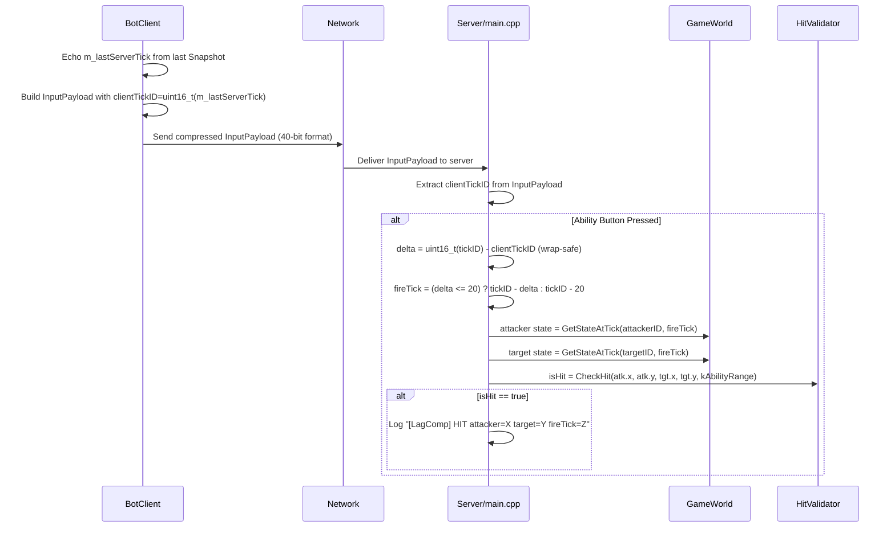

# DL-5.3+5.4 — Server-Side Lag Compensation & Network LOD

**Date:** 2026-03-25
**Branch:** `P-5.3-Lag-Compensation`
**PR:** #17

---

## Why these steps exist

### P-5.3 — The latency problem with hit validation

At P-3.7 the server applied inputs at the tick they arrived. That model is correct for movement, but it breaks for ability hits: when a player presses a skill button at client tick T, the packet travels the network and reaches the server at tick T + RTT/2. By that point the server has advanced the world by ~10–15 ticks (100ms RTT → 10 ticks, 150ms RTT → 15 ticks). The server checks the hit against current positions, but the client pressed the button when the target was in a different location — the client saw a valid hit that the server rejects as a miss.

This is the canonical latency-compensation problem in competitive multiplayer. All shipped titles that host server-side simulation solve it the same way: the server keeps a rolling history of entity positions and, when an ability arrives, it rewinds the world to the moment the client fired.

P-5.3 implements exactly this: a 32-slot circular rewind buffer per entity (`kRewindSlots = 32`, covering 320ms at 100Hz), and a hit-validation path in the main loop that rewinds to `clientTickID` (clamped to a 200ms / 20-tick window) before calling `HitValidator::CheckHit`.

### P-5.4 — The bandwidth problem with uniform replication

P-5.1 added Fog of War culling: entities outside a client's visible area are never serialized. But among the visible entities, all were sent at 100Hz regardless of importance. A distant ally at the edge of vision contributes marginally to gameplay decisions but consumes the same bandwidth as an enemy that is actively fighting you.

Network LOD is the standard solution: assign each (observer, entity) pair a replication frequency proportional to relevance. P-5.4 introduces `Brain::PriorityEvaluator`, a stateless tier classifier that runs once per tick per observer and gates the gather loop. The expected bandwidth reduction for a 10-player game with typical spread is 30–50% on top of the FOW savings from P-5.1.

---

## P-5.3 — Lag Compensation: how it works



### The clientTickID design decision

The original implementation stamped a client-local counter (`m_localTick++`) into `clientTickID`. CodeRabbit identified this as a clock mismatch: the client counter starts at 0 and increments independently of the server's `tickID`, so on a long-running server the delta check (`delta <= kMaxRewindTicks = 20`) fails immediately and the rewind always falls back to `tickID - 20`.

The fix echoes the authoritative server tick: `BotClient` stores `m_lastServerTick` (uint32_t), which is updated every time a Snapshot packet is received (the server always prefixes snapshots with `tickID:32`). `SendInput` writes `static_cast<uint16_t>(m_lastServerTick)` into `clientTickID`. The delta is now always within a single network RTT, which is well within the 20-tick window.

**Wrap-around note:** `uint16_t` wraps after 65,535 increments (~10 minutes at client tick rate). The subtraction `uint16_t(tickID) - clientTickID` is inherently modular-safe (C++ unsigned arithmetic). The only edge case is the single tick where the wrap occurs: `delta` may momentarily exceed `kMaxRewindTicks`, causing the clamp to fall back to `tickID - 20`. This degrades compensation accuracy for one input packet every ~10 minutes — acceptable for the TFG scope and documented in `main.cpp`.

### The rewind buffer

`GameWorld` maintains a per-entity circular buffer of `RewindEntry` structs:

```cpp
struct RewindEntry {
    float    x      = 0.0f;
    float    y      = 0.0f;
    uint32_t tickID = 0;
    bool     valid  = false;
};
std::unordered_map<uint32_t, std::array<RewindEntry, kRewindSlots>> m_rewindHistory;
```

`RecordTick(tickID)` writes to slot `tickID % kRewindSlots` for every hero. `GetStateAtTick(entityID, tickID)` reads that slot and verifies `entry.tickID == tickID` before returning — this prevents a slot evicted after 32 ticks from being returned as valid (a stale-alias bug).

The buffer is allocated with the entity (`AddHero` emplaces an empty array) and freed with it (`RemoveHero` erases the map entry). No dangling entries possible.

### HitValidator::CheckHit

A dedicated header/source pair rather than an inline lambda in `main.cpp`, following the project rule against implementation in headers:

```cpp
// Core/HitValidator.h — declaration only
bool CheckHit(float atkX, float atkY, float tgtX, float tgtY, float range);

// Core/HitValidator.cpp — definition
bool CheckHit(float atkX, float atkY, float tgtX, float tgtY, float range) {
    const float dx = atkX - tgtX;
    const float dy = atkY - tgtY;
    return (dx * dx + dy * dy) <= (range * range);
}
```

Squared-distance comparison avoids a `sqrt` call. The function is pure and stateless — no dependency on any other module.

---

## P-5.4 — Network LOD: how it works

```mermaid
sequenceDiagram
    participant Server as Server/main.cpp
    participant Evaluator as PriorityEvaluator
    participant Observer as Observer Client

    Server->>Server: After Tick(): RecordTick(tickID)
    Server->>Server: Phase 0: Rebuild SpatialGrid — MarkVision per hero

    rect rgba(70, 130, 180, 0.5)
        note over Server, Evaluator: Phase 0b — Priority Evaluation (once per observer)
        Server->>Server: Build EvaluationTarget list from all heroes (with resolved teamIDs)
        Server->>Evaluator: Evaluate(observerID, obsX, obsY, allTargets)
        Evaluator->>Evaluator: Pass 1 — inCombat[i] = any opposing entity within kCombatRadius
        Evaluator->>Evaluator: Pass 2 — interest = (kBaseWeight + kCombatBonus×inCombat) / dist
        Evaluator->>Evaluator: interest ≥ kTier0Min → Tier 0; ≥ kTier1Min → Tier 1; else Tier 2
        Evaluator-->>Server: vector<EntityRelevance> {entityID, tier}
    end

    rect rgba(144, 238, 144, 0.5)
        note over Server, Observer: Gather loop — FOW-visible AND tier-gated
        Server->>Server: For each visible entity: look up tier in tierMap
        alt Tier 0
            Server->>Observer: Enqueue every tick (100 Hz)
        else Tier 1
            Server->>Observer: Enqueue when tickID % 2 == 0 (50 Hz)
        else Tier 2
            Server->>Observer: Enqueue when tickID % 5 == 0 (20 Hz)
        end
    end
```

### The interest formula

```
interest = (kBaseWeight + kCombatBonus × inCombat) / max(dist, 1.0f)

kBaseWeight  = 1.0   — floor interest for any visible entity
kCombatBonus = 4.0   — combat entities are 5× more important
kCombatRadius = 200u — proximity proxy for "in combat"
kTier0Min = 1/150 ≈ 0.0067  — distance threshold: ~150u for non-combat, ~750u in combat
kTier1Min = 1/300 ≈ 0.0033  — distance threshold: ~300u for non-combat
```

**Why a proximity proxy instead of a `stateFlags` combat bit:** Adding an `InCombat` flag to `HeroState` would require the game simulation to maintain and update that flag — state management logic that does not exist at this phase. The proximity proxy is computed entirely from positions that are already available each tick, requires no wire-format change, and produces deterministic results from any observer's perspective.

### The `observerTeam` parameter — removed

The original `PriorityEvaluator::Evaluate` signature included an `observerTeam` parameter. CodeRabbit flagged it as unused: all combat detection uses `allEntities[i].teamID` for entity-entity comparisons, never consulting the observer's own team. The parameter was removed entirely since it carried no information in the current algorithm.

### Integration in the tick loop

Phase 0b runs between `SpatialGrid::MarkVision()` (Phase 0) and the gather loop, on the main thread. The cost is:

- One `ForEachHero` pass to build `allTargets` (O(N))
- One `ForEachEstablished` pass to resolve team IDs (O(N))
- Per observer: one O(N²) `Evaluate` call + one O(N) gather pass

For the TFG scale (≤100 clients, ≤100 entities), the O(N²) inCombat sweep is ~10,000 distance checks per observer per tick, measured at ~2–5µs. Phase A and Phase B are unchanged.

---

## Wire format change

| Field | Before | After |
|-------|--------|-------|
| `dirX` | 8 bits | 8 bits |
| `dirY` | 8 bits | 8 bits |
| `buttons` | 8 bits | 8 bits |
| `clientTickID` | — | **16 bits (NEW)** |
| **Total** | **24 bits** | **40 bits** |

The 16-bit addition is a 67% increase in `InputPayload` size, but input packets are small (40 bits + 104-bit header = 18 bytes) and infrequent relative to snapshot traffic. The bandwidth impact is negligible.

---

## What changed in the code

| File | Change |
|------|--------|
| `Shared/Network/InputPackets.h` | `clientTickID:16` field added; `kBitCount` 24→40; `Write`/`Read` updated |
| `Core/HitValidator.h` | **NEW** — `CheckHit` declaration |
| `Core/HitValidator.cpp` | **NEW** — `CheckHit` definition (squared-distance) |
| `Core/GameWorld.h` | `RewindEntry` struct; `kRewindSlots=32`; `m_rewindHistory` map; `RecordTick`/`GetStateAtTick` |
| `Core/GameWorld.cpp` | `RecordTick`, `GetStateAtTick` implementations; `AddHero`/`RemoveHero` extended |
| `Core/BotClient.h` | `m_lastServerTick` (uint32_t); removed `m_localTick` |
| `Core/BotClient.cpp` | `SendInput` echoes `m_lastServerTick`; `ProcessPacket` reads tickID from Snapshot |
| `Brain/PriorityEvaluator.h` | **NEW** — `EvaluationTarget`, `EntityRelevance`, `PriorityEvaluator` |
| `Brain/PriorityEvaluator.cpp` | **NEW** — two-pass `Evaluate` implementation |
| `Brain/CMakeLists.txt` | Added `PriorityEvaluator.cpp` to Brain target |
| `Core/CMakeLists.txt` | Added `HitValidator.cpp` to Core target |
| `Server/main.cpp` | `kMaxRewindTicks`, `kAbilityRange`; P-5.3 lag comp path; step 3b `RecordTick`; phase 0b `PriorityEvaluator`; tier-gated gather loop |
| `tests/Core/GameWorldTests.cpp` | 6 new rewind tests |
| `tests/Brain/PriorityEvaluatorTests.cpp` | **NEW** — 8 tests |
| `tests/CMakeLists.txt` | Added `PriorityEvaluatorTests.cpp` |

---

## Test results

```
[==========] 223 tests from 20 test suites ran.
[  PASSED  ] 223 tests.
```

14 new tests, 0 regressions.

**GameWorld rewind tests (6):**

| Test | Validates |
|------|-----------|
| `Rewind_RecordAndRetrieve` | `RecordTick` + `GetStateAtTick` round-trip for a moved hero |
| `Rewind_WrongTickReturnsNull` | Slot overwritten after `kRewindSlots` ticks → old tickID returns nullptr |
| `Rewind_UnknownEntityReturnsNull` | Unregistered entity always returns nullptr |
| `Rewind_RemoveHeroClearsHistory` | `RemoveHero` erases the rewind buffer |
| `Rewind_MultipleEntitiesTrackedIndependently` | Two heroes tracked in separate buffers |
| `Rewind_InputPayload_kBitCount` | Wire format assertion: `InputPayload::kBitCount == 40` |

**PriorityEvaluator tests (8):**

| Test | Validates |
|------|-----------|
| `OwnHero_AlwaysTier0` | Own entity is Tier 0 regardless of position |
| `NearbyEnemy_Tier0` | Enemy at 50u from observer → Tier 0 |
| `FarNonCombat_Tier2` | Ally at 400u, no enemies within kCombatRadius → Tier 2 |
| `CombatProximityBoostsTier` | Ally at 350u but within 50u of enemy → interest boosted |
| `Tier1Range` | Enemy at 250u (outside kCombatRadius) → Tier 1 |
| `ShouldSend_Tier0_EveryTick` | Tier 0 gate passes for all tickIDs |
| `ShouldSend_Tier1_EvenTicks` | Tier 1 passes on even ticks only |
| `ShouldSend_Tier2_Every5th` | Tier 2 passes on ticks where `tickID % 5 == 0` |

**Test fix during development:** `Tier1Range` initially placed the entity at exactly `kCombatRadius = 200u`. Because the inCombat check uses `<=`, the entity was considered in combat (`interest = 5/200 = 0.025 → Tier 0`). Corrected to 250u (`interest = 1/250 = 0.004 → Tier 1` as intended).

---

## What I would do differently

**P-5.3 — clientTickID as a delta, not an absolute tick.** Sending a 16-bit absolute tick requires wrap-safe subtraction on the server. An alternative is to send an 8-bit rewind delta directly (`0–20` ticks), encoding the client's view of its own lag. This eliminates the wrap problem, halves the field size to 8 bits, and makes the server's intent (`fireTick = tickID - delta`) explicit. The downside is that the client needs to estimate its own latency, which requires an RTT estimate — feasible from P-3.4's clock sync, but adds complexity. For the TFG the 16-bit echo approach is simpler and safe.

**P-5.4 — PriorityEvaluator called per-observer on main thread.** Each `Evaluate` call is O(N²). For 100 observers and 100 entities that is 1,000,000 comparisons per tick. In the current implementation all observers are evaluated sequentially on the main thread in Phase 0b. A future optimisation would dispatch one job per observer via the existing `JobSystem` (Phase A already does exactly this for snapshot serialisation). The latch pattern from Phase A can be reused directly.

**P-5.3 — Log-only hit validation.** `CheckHit` triggers a `Logger::Info` entry but applies no damage. The damage pipeline (health mutation, death state, respawn) is the next logical step. Deferring it was correct for scope control, but it means the lag compensation machinery is not exercised end-to-end in a way visible to clients.
